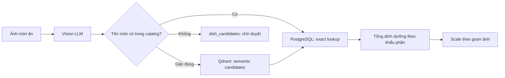

# FoodAI

FoodAI nhận diện món ăn Việt từ ảnh và ước lượng dinh dưỡng theo khẩu phần. Đây là portfolio project cho hướng AI Engineer: kết hợp Vision LLM, catalog dinh dưỡng có provenance, semantic retrieval và FastAPI.

## Vấn đề và cách giải quyết

Ảnh món ăn không cho biết chính xác công thức hay khối lượng. FoodAI tách bài toán thành các mức độ tin cậy thay vì biến dự đoán AI thành dữ liệu chuẩn:



- `vn_ingredients`: nguyên liệu và dinh dưỡng per-gram; PostgreSQL là nguồn dữ liệu chuẩn.
- `vn_dishes`: món đã duyệt, tổng dinh dưỡng theo khẩu phần và gram ước lượng có nguồn/độ tin cậy/quy tắc.
- `dish_candidates`: kết quả Vision chưa được duyệt; không được đưa vào catalog hay semantic index.
- Qdrant `food_catalog`: chỉ mục vector dẫn về UUID PostgreSQL, có thể dựng lại hoàn toàn bằng script reindex.

## Những điểm kỹ thuật đáng chú ý

- FastAPI async + PostgreSQL + Qdrant + Alembic migration.
- Vision output được validate, chuẩn hóa và đưa vào staging thay vì ghi thẳng vào dữ liệu tham chiếu.
- Exact lookup không phân biệt dấu tiếng Việt, sau đó mới fallback Qdrant với lexical guard để tránh match khác họ món.
- Dinh dưỡng `vnmeal` được lưu theo **khẩu phần của nguồn**, không giả định là per-100g.
- Gram khẩu phần là ước lượng minh bạch (`typical_grams_source`, `confidence`, `rule`), không tự nhận là số đo y khoa.
- Deterministic evaluation và RAGAS evaluation tách riêng để kết quả có thể lặp lại.

## Quick start

Hướng dẫn đầy đủ để mở backend, model server và iOS Simulator: [LOCAL_TESTING.md](LOCAL_TESTING.md).

Yêu cầu: Python 3.12+, Docker, và `uv`.

```bash
cp .env.example .env
docker compose up -d postgres qdrant
uv sync --all-groups
uv run alembic upgrade head
```

Embedding server chạy riêng vì model local không nằm trong Docker:

```bash
llama-server \
  --model models/Qwen3-Embedding-0.6B-Q8_0.gguf \
  --embedding --port 8081 --host 0.0.0.0
```

Nạp dữ liệu và dựng lại semantic index:

```bash
DEBUG=false uv run python scripts/seed_nutrition.py
DEBUG=false uv run python scripts/recreate_vn_dishes.py
DEBUG=false uv run python scripts/rebuild_dish_servings.py --apply
DEBUG=false uv run python scripts/cleanup_vn_dishes.py
DEBUG=false uv run python scripts/cleanup_vn_dishes.py --apply
DEBUG=false uv run python scripts/reindex_qdrant.py
```

Lệnh cleanup đầu tiên luôn là **dry-run** để in đúng các thay đổi dự kiến. Bản
`--apply` ghi snapshot trước khi sửa/xóa vào `catalog_cleanup_log`, nên mọi thay
đổi tự động đều truy vết được. Nếu cleanup có xóa duplicate sau khi Qdrant đã
được dựng, đồng bộ các UUID đã lưu trong journal sau khi PostgreSQL commit:

```bash
DEBUG=false uv run python scripts/cleanup_vn_dishes.py --sync-qdrant
```

Kiểm tra Qdrant có khớp tuyệt đối với UUID trong PostgreSQL mà không thay đổi dữ liệu:

```bash
DEBUG=false uv run python scripts/reindex_qdrant.py --check
```

Chạy API:

```bash
uv run uvicorn backend.main:app --reload
```

API docs: `http://localhost:8000/docs`.

## Quality checks

```bash
uv run alembic check
uv run pytest -q
DEBUG=false uv run python scripts/audit_catalog.py --fail-on error
DEBUG=false uv run python -m ml.evaluation.catalog_eval --output reports/catalog_eval.md
```

`audit_catalog.py` chỉ đọc dữ liệu và kiểm tra số âm, khẩu phần bất khả thi,
candidate không thể duyệt, duplicate khác hoa/thường và độ lệch calories so với
macro. Va chạm tìm kiếm bỏ dấu như “dưa/dứa” chỉ là warning, tuyệt đối không tự
gộp. CI seed catalog thật, chạy cleanup rồi thất bại nếu audit còn `error`; báo
cáo Markdown được giữ lại cùng coverage artifact.

`catalog_eval` đo accuracy và coverage trên bộ câu truy vấn tiếng Việt có dấu/không dấu. RAGAS evaluation chậm hơn và dùng LLM judge được chạy riêng:

```bash
DEBUG=false uv run python -m ml.evaluation.rag_eval
```

## Deploy

Image API chỉ đóng gói dependency runtime; training và RAGAS evaluation không làm phình production image:

```bash
docker build -t foodai-api .
docker run --rm -p 8000:8000 --env-file .env foodai-api
```

Khi deploy lên Render, Railway hay Fly.io, dùng `.env.production.example` làm checklist biến môi trường, cung cấp `DATABASE_URL`, `QDRANT_URL`, `VISION_API_KEY`, `VISION_API_BASE`, `REDIS_URL`, thông tin S3 và chạy `alembic upgrade head` trong release command. PostgreSQL giữ dữ liệu chuẩn; Qdrant chỉ giữ vector cho semantic search của catalog/chat. Flow ảnh hiện tại là Vision → catalog PostgreSQL; không cần EfficientNet, SigLIP hay image-embedding sidecar.

### Production layout

Repo chỉ nên chứa code, migration, schema, seed catalog nhỏ và script vận hành. Các thư mục nặng hoặc có dữ liệu người dùng phải nằm ngoài Git:

```text
Git repo
  backend/
  schemas/
  ml/inference/
  ml/evaluation/
  ml/training/
  alembic/
  scripts/
  data/*.json
  data/eval/*.json

Local/training only, không commit
  data/images/train/
  data/images/val/
  data/images/test/
  data/images/references/
  data/images/siglip_fast_lane/
  checkpoints/experiments/
  checkpoints/siglip_fast_lane/
  models/*.gguf

Production runtime
  PostgreSQL       dữ liệu chuẩn
  Qdrant           semantic index dựng lại được
  S3               ảnh upload/feedback/object
  Redis            rate limit/session runtime
  Vision API          Qwen Vision image recognition
```

`.gitignore` đã loại `data/images/`, `checkpoints/`, `models/*.gguf` và `.dockerignore` cũng chặn toàn bộ dữ liệu nặng. Checkpoint EfficientNet/Dockerfile.cv cũ vẫn được giữ riêng cho rollback/offline evaluation, nhưng không được API hoặc image-embedding sidecar khởi động.

### Archived local image-model experiments

Các trainer, checkpoint, reference album và Dockerfile của EfficientNet/SigLIP
được giữ lại để xem lại kết quả hoặc rollback, nhưng không nằm trong flow API
và không được `scripts/dev_up.sh` khởi động. Thay đổi chúng không thay đổi kết
quả nhận diện production cho đến khi có một kế hoạch release riêng.

Các lệnh train/re-index cũ vẫn nằm trong lịch sử repo để phục vụ nghiên cứu;
không chạy chúng trong môi trường production hiện tại. Muốn đưa một local
image model trở lại cần một release plan và bộ đánh giá riêng.

### Dataset sync

Ảnh train nên sống ở S3 hoặc MinIO dưới một prefix riêng, rồi sync về máy train khi cần:

```bash
# push local train set lên S3/MinIO
DATASET_S3_BUCKET=foodai-datasets \
DATASET_S3_PREFIX=datasets/train \
DATASET_S3_ENDPOINT_URL=http://localhost:9000 \
DATASET_S3_ACCESS_KEY_ID=foodai_local \
DATASET_S3_SECRET_ACCESS_KEY=change-this-local-password \
uv run python scripts/sync_image_dataset.py push --root data/images/train --create-bucket

# pull lại về máy train
DATASET_S3_BUCKET=foodai-datasets \
DATASET_S3_PREFIX=datasets/train \
DATASET_S3_ENDPOINT_URL=http://localhost:9000 \
DATASET_S3_ACCESS_KEY_ID=foodai_local \
DATASET_S3_SECRET_ACCESS_KEY=change-this-local-password \
uv run python scripts/sync_image_dataset.py pull --root data/images/train
```

Mặc định script giữ nguyên cây thư mục dưới root, nên `data/images/train/pho_bo/a.jpg` sẽ thành `s3://bucket/datasets/train/pho_bo/a.jpg`. Nếu muốn tách version dataset, đổi prefix thành `datasets/v1/train`, `datasets/v2/train`... là xong.

## Giới hạn hiện tại

- Gram của món `vnmeal` là heuristic; cần thêm dữ liệu khẩu phần đo thực tế để dùng trong bối cảnh sức khỏe/y tế.
- Vision có thể nhầm món có ngoại hình gần nhau; candidate cần được review trước khi xuất bản.
- Chưa có authentication/multi-user production. Đây là bước phù hợp tiếp theo nếu phát triển thành sản phẩm thật.
