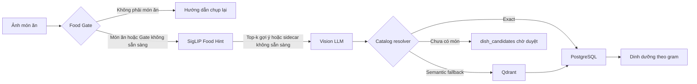

# FoodAI

FoodAI là ứng dụng phân tích ảnh món ăn Việt và theo dõi dinh dưỡng. Người dùng có thể chụp ảnh hoặc nhập tên món, nhận ước lượng dinh dưỡng theo khẩu phần, lưu nhật ký bữa ăn, đặt mục tiêu và trò chuyện với trợ lý dinh dưỡng.

## Luồng phân tích ảnh



- Food Gate chặn ảnh không phải món ăn trước khi gọi Vision khi chạy ở chế độ `enforce`; nếu Gate lỗi, hệ thống fail-open sang Vision.
- SigLIP Food Hint là classifier fine-tune riêng, chỉ đưa tối đa top-k tên món làm gợi ý cho Vision khi ở chế độ `hint`; không tự chốt món hoặc dinh dưỡng. Nếu model/sidecar lỗi hay score chưa đủ cao, Vision chạy không có gợi ý.
- Vision chỉ là dự đoán. PostgreSQL là nguồn dữ liệu dinh dưỡng chuẩn; Qdrant chỉ là semantic index có thể dựng lại.
- Món chưa có catalog được đưa vào `dish_candidates`, không tự động thành dữ liệu tham chiếu.

## Thành phần chính

| Thành phần | Vai trò |
|---|---|
| FastAPI | API, authentication, phân tích, nhật ký và gợi ý |
| PostgreSQL | Catalog, user, phiên đăng nhập, meal log và nutrition goals |
| Qdrant | Semantic retrieval cho catalog và RAG; dữ liệu dẫn xuất |
| Vision API | Nhận diện món ăn từ ảnh |
| Food Gate + SigLIP Food Hint + segmentation | Chặn ảnh ngoài phạm vi, gợi ý candidate cho Vision và tạo sticker trong ML sidecar |
| Flutter Balance | Ứng dụng iOS/Android |

API có đăng ký/đăng nhập email-mật khẩu, đăng nhập Google, refresh token và logout. Google Sign-In production cần Web client ID ở backend và OAuth clients tương ứng cho Android/iOS.

## Chạy local

Yêu cầu: Python 3.12+, [uv](https://docs.astral.sh/uv/), Docker và (tuỳ chọn) `llama-server` cho chat/embedding local.

```bash
cp .env.example .env
uv sync --all-groups
bash scripts/dev_up.sh
```

`dev_up.sh` bật PostgreSQL, Qdrant, Food Gate, segmentation, migration và API. Thêm `--no-llm` nếu chưa cài `llama-server`:

```bash
bash scripts/dev_up.sh --no-llm
curl -fsS http://127.0.0.1:8000/ready
```

API docs: <http://127.0.0.1:8000/docs>.

Tắt môi trường local nhưng giữ Docker volumes:

```bash
bash scripts/dev_down.sh
```

### Dữ liệu catalog và Qdrant

Sau migration, các script catalog chạy theo thứ tự dưới đây. PostgreSQL là canonical source; có thể reindex Qdrant bất kỳ lúc nào.

```bash
DEBUG=false uv run python scripts/seed_nutrition.py
DEBUG=false uv run python scripts/recreate_vn_dishes.py
DEBUG=false uv run python scripts/rebuild_dish_servings.py --apply
DEBUG=false uv run python scripts/reindex_qdrant.py
```

## Ứng dụng mobile

Từ thư mục `mobile/`, tạo cấu hình build local (file này đã bị Git ignore):

```bash
cp dart_defines.example.json dart_defines.json
flutter pub get
flutter run --dart-define-from-file=dart_defines.json
```

`API_BASE_URL` bắt buộc dùng HTTPS ở bản release. `GOOGLE_WEB_CLIENT_ID` phải trùng client ID backend dùng để kiểm tra Google ID token. Chi tiết build và cấu hình mobile: [`mobile/README.md`](mobile/README.md).

## Kiểm tra chất lượng

```bash
uv run alembic check
uv run pytest -q
DEBUG=false uv run python scripts/audit_catalog.py --fail-on error
```

## Deploy production

For GPU-backed Food Gate and SigLIP Food Hint deployment outside Railway, see
[RunPod GPU sidecar guide](docs/runpod-gpu-sidecar.md). Railway can continue
to host the API and data services while RunPod serves only the ML sidecar.

Production gồm API, PostgreSQL, Qdrant, Redis, object storage, Vision API và ML sidecar. Sidecar hiện cung cấp Food Gate, SigLIP Food Hint và segmentation; chat cần LLM endpoint và embedding runtime phù hợp.

1. Dùng [`.env.production.example`](.env.production.example) làm checklist, nhưng nhập secrets trong dashboard của nền tảng deploy — không commit file có giá trị thật.
2. Đặt `ENVIRONMENT=production`, `RATE_LIMIT_BACKEND=redis`, S3 object storage, `DATABASE_URL`, `QDRANT_URL`, Vision key và `AUTH_SECRET_KEY` riêng có ít nhất 32 ký tự.
3. Để bật luồng production hiện tại, đặt `FOOD_GATE_MODE=enforce`, `FOOD_GATE_URL`, `FOOD_GATE_SERVICE_TOKEN` và `SIGLIP_FOOD_HINT_MODE=hint`. Đặt `SIGLIP_FOOD_HINT_URL` trỏ tới cùng ML sidecar với suffix `/siglip` (ví dụ private URL của sidecar cộng `/siglip`).
4. Food Gate sidecar cần checkpoint Gate và artifact SigLIP đã kiểm tra SHA-256 trong object storage. Các biến `FOOD_GATE_CHECKPOINT_*` và `SIGLIP_FOOD_V1_ARTIFACT_*` chỉ đặt trên sidecar; không commit artifact hay secret vào Git.
5. Chạy `alembic upgrade head` trong release/deploy process, sau đó kiểm tra API `/live`, `/health`, `/ready` và sidecar `/siglip/live`. `/siglip/ready` sẽ trả `cold` trước lần dự đoán đầu tiên và `ready` sau khi model được nạp.

## Bảo mật và Git

Không commit secrets, ảnh upload, database dump, checkpoint/model local, file keystore hay cấu hình build thật. Các ghi chú local (`docs/`, `plan.md`, `LOCAL_TESTING.md`, agent memories), báo cáo sinh tự động và `mobile/dart_defines.json` đều bị `.gitignore` chặn.

## Giới hạn

- Dinh dưỡng và gram là ước lượng, không phải tư vấn y tế.
- Vision có thể nhầm món; món mới cần review trước khi đưa vào catalog.
- OAuth có thể yêu cầu Google verification nếu sau này dùng sensitive/restricted scopes hoặc thay đổi branding/domain theo điều kiện của Google.
