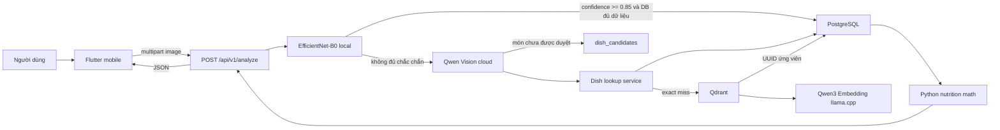
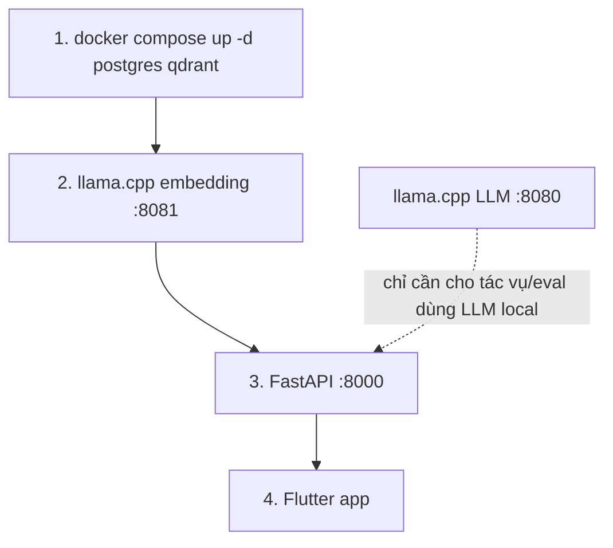
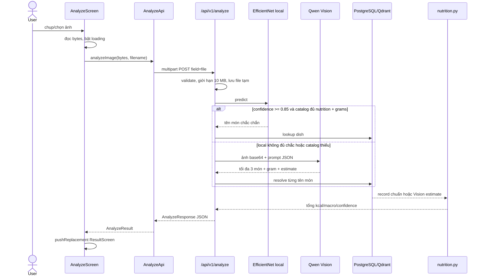
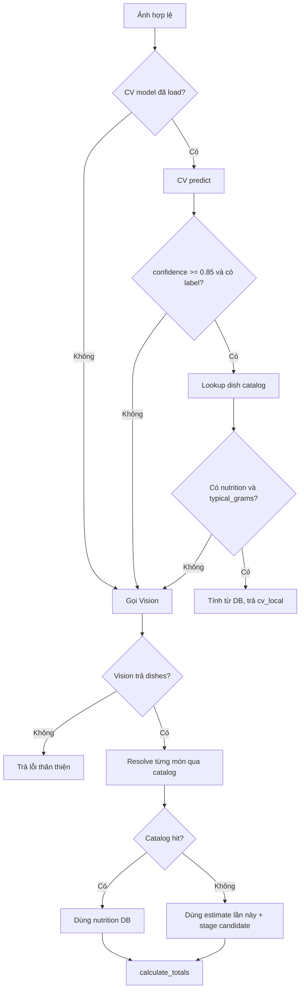
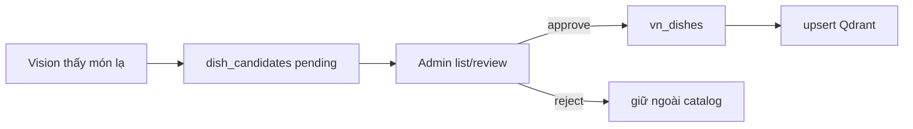
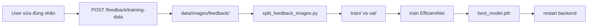

# FoodAI — Giải thích code, logic, luồng chạy và thuật toán training

> Tài liệu này mô tả **code đang tồn tại trong repository tại ngày 24/07/2026**.
> Nếu tài liệu kế hoạch cũ mâu thuẫn với source code, source code hiện tại được xem là
> nguồn sự thật.

## 1. FoodAI thực sự đang giải bài toán gì?

FoodAI nhận một ảnh món ăn từ mobile, cố gắng trả lời ba câu hỏi:

1. Trong ảnh là món gì?
2. Khẩu phần ước tính nặng bao nhiêu?
3. Với khẩu phần đó, có bao nhiêu kcal, đạm, béo, carb và chất xơ?

Đây không phải một model duy nhất làm tất cả. Hệ thống là một dây chuyền gồm nhiều
thành phần, mỗi thành phần chịu trách nhiệm cho một loại việc:

- **Flutter mobile** chụp/chọn ảnh, upload và hiển thị kết quả.
- **FastAPI** là người điều phối toàn bộ luồng.
- **EfficientNet-B0 local** phân loại nhanh tám món đã được train.
- **Qwen Vision cloud** xử lý ảnh khó, món ngoài tám class và combo nhiều món.
- **PostgreSQL** giữ dữ liệu dinh dưỡng chính thức và trạng thái duyệt.
- **Embedding model + Qdrant** tìm tên gần nghĩa khi text không khớp chính xác.
- **Python thuần** thực hiện phép nhân/cộng dinh dưỡng. LLM không được tự làm toán
  cho dữ liệu đã có trong database.

Ẩn dụ đời thường: hãy tưởng tượng FoodAI là một quán ăn.

- Flutter là nhân viên nhận món từ khách.
- FastAPI là quản lý ca, quyết định chuyển phiếu cho ai.
- EfficientNet là nhân viên lâu năm, nhận rất nhanh các món quen.
- Qwen Vision là chuyên gia bên ngoài, biết nhiều món hơn nhưng gọi chậm và tốn phí.
- PostgreSQL là sổ công thức chính thức.
- Qdrant là nhân viên nhớ món theo “ý nghĩa gần giống”, nhưng không được tự sửa sổ.
- Các hàm nutrition là máy tính tiền: chỉ tính theo số có sẵn, không phỏng đoán.

## 2. Bức tranh kiến trúc trong 60 giây



Hai nguyên tắc thiết kế quan trọng nhất:

1. **PostgreSQL là source of truth.** Qdrant chỉ trả UUID ứng viên, sau đó code luôn
   lấy bản ghi thật lại từ PostgreSQL.
2. **AI nhận diện, code deterministic tính toán.** Khi database có dữ liệu, AI không
   được ghi đè dinh dưỡng bằng con số tự ước lượng.

## 3. Bản đồ thư mục và lý do phải tách file

```text
food-ai/
├── backend/
│   ├── main.py                 # tạo FastAPI app, startup và gắn router
│   ├── config.py               # đọc .env thành cấu hình có type
│   ├── api/                    # tầng HTTP: nhận request, trả response
│   │   ├── analyze.py          # điều phối luồng phân tích ảnh
│   │   ├── dishes.py           # tra cứu món đã duyệt
│   │   ├── feedback.py         # nhận ảnh user sửa nhãn cho lần train sau
│   │   ├── upload_utils.py     # kiểm tra loại file và giới hạn dung lượng
│   │   └── chat.py             # SSE echo demo, chưa phải chat AI production
│   ├── db/
│   │   ├── postgres.py         # engine, session factory, dependency mỗi request
│   │   └── models.py           # ánh xạ bảng PostgreSQL thành ORM class
│   └── services/               # business logic không phụ thuộc giao diện HTTP
│       ├── dishes.py           # exact/semantic lookup và đổi serving -> per gram
│       ├── embeddings.py       # client gọi llama.cpp embedding
│       ├── vector_catalog.py   # đọc/ghi semantic index Qdrant
│       ├── dish_candidates.py  # hàng chờ món Vision chưa được người duyệt
│       └── serving_estimates.py# heuristic ước lượng typical_grams có provenance
├── schemas/
│   ├── analyze.py              # hợp đồng JSON của API analyze
│   └── nutrition.py            # value object và các phép tính dinh dưỡng
├── ml/
│   ├── training/
│   │   ├── dataset.py          # đọc ảnh + augmentation
│   │   └── train.py            # fine-tune EfficientNet-B0
│   ├── inference/
│   │   ├── cv.py               # load checkpoint và predict local
│   │   └── vision.py           # prompt, gọi Qwen Vision, validate output
│   └── evaluation/             # đánh giá lookup/RAG, tách khỏi pytest nhanh
├── mobile/lib/
│   ├── app.dart                # MaterialApp và màn hình đầu tiên
│   ├── core/                   # theme, config, widget dùng chung
│   └── features/               # auth, onboarding, dashboard, analyze, suggestions
├── alembic/                    # lịch sử schema database có version
├── scripts/                    # seed, reindex, review, data pipeline
├── tests/                      # executable specification của backend
├── data/                       # JSON catalog, ảnh train/val/feedback, upload tạm
└── checkpoints/                # model weights, class mapping, training history
```

### Vì sao không để tất cả vào một file?

Nếu `analyze.py` vừa mở ảnh, gọi model, viết SQL, tính nutrition, tạo Qdrant collection
và format Flutter response thì thay một chi tiết sẽ dễ làm hỏng phần khác. Cách chia
hiện tại áp dụng **separation of concerns**:

- `api/` biết HTTP nhưng không cần biết Qdrant gọi endpoint nào.
- `services/` biết luật nghiệp vụ nhưng không cần biết request đến từ mobile hay test.
- `schemas/` định nghĩa hình dạng dữ liệu và toán dùng chung.
- `ml/` chứa phần phụ thuộc PyTorch/model để backend vẫn có thể chạy khi local CV
  chưa cài đủ dependency.
- `mobile/features/` gom code theo tính năng. Khi bỏ tính năng suggestions, không phải
  lục trong một thư mục khổng lồ gồm mọi screen.

Đây giống cách chia bếp nhà hàng: khu nhận order, khu nấu, kho nguyên liệu và quầy tính
tiền tách nhau. Mỗi khu có thể thay đổi dụng cụ mà không bắt cả quán đóng cửa.

## 4. Hệ thống khởi động như thế nào?

### 4.1 Thứ tự các service



Các lệnh cơ bản:

```bash
cd /Users/nguyenhailong/Documents/project/food-ai
docker compose up -d postgres qdrant

llama-server \
  --model models/Qwen3-Embedding-0.6B-Q8_0.gguf \
  --embedding --port 8081 --host 0.0.0.0

uv run uvicorn backend.main:app --reload

cd /Users/nguyenhailong/Documents/project/food-ai/mobile
flutter run
```

Nếu simulator iOS chạy trên cùng Mac, mobile mặc định gọi `127.0.0.1:8000`. Android
emulator dùng `10.0.2.2:8000`, vì `127.0.0.1` bên Android là chính emulator.

Khi chạy trên điện thoại thật, truyền IP LAN của Mac:

```bash
flutter run --dart-define=API_BASE_URL=http://192.168.x.x:8000
```

FastAPI khi đó nên listen trên mạng LAN:

```bash
uv run uvicorn backend.main:app --reload --host 0.0.0.0
```

### 4.2 Có phải restart backend mỗi lần không?

- Sửa file Python khi chạy `uvicorn --reload`: thường **không cần restart thủ công**.
- Sửa `.env`, cài dependency, đổi checkpoint hoặc service bị treo: nên restart backend.
- Train ra `checkpoints/best_model.pth` mới: backend đang giữ model cũ trong RAM, nên
  **phải restart backend** để `cv_model.load()` nạp weights mới.
- Sửa Flutter UI: nhấn `r` để hot reload; thay initialization/native config thì nhấn
  `R` để hot restart hoặc chạy lại `flutter run`.
- PostgreSQL/Qdrant đã chạy ổn thì không cần restart chỉ vì mở lại mobile.

### 4.3 `backend/main.py` làm gì khi startup?

Đoạn quan trọng:

```python
@asynccontextmanager
async def lifespan(app: FastAPI):
    await asyncio.to_thread(cv_model.load)
    await asyncio.to_thread(init_collection)
    yield
```

Giải thích từng dòng:

- `@asynccontextmanager`: biến hàm thành vòng đời “trước khi app chạy / sau khi app
  dừng”.
- `cv_model.load`: nạp class mapping và checkpoint vào RAM một lần, thay vì nạp lại
  cho từng request.
- `asyncio.to_thread(...)`: việc load PyTorch và gọi Qdrant sync có thể chặn event
  loop; đưa sang worker thread giúp FastAPI không bị đứng.
- `init_collection`: bảo đảm collection Qdrant tồn tại, nhưng không tự xóa dữ liệu cũ.
- `yield`: từ đây app bắt đầu nhận request.

Hai bước đều được bọc `try/except`. CV hỏng thì hệ thống vẫn dùng Vision; Qdrant hỏng
thì exact lookup PostgreSQL vẫn chạy. Đây gọi là **graceful degradation**: hỏng một
dịch vụ phụ không kéo sập toàn bộ sản phẩm.

### 4.4 `config.py`, `postgres.py` và `models.py` phối hợp ra sao?

`backend/config.py` gom biến môi trường thành một `Settings` object có type. Thay vì
mỗi file tự gọi `os.getenv("...")`, toàn app dùng cùng một nguồn:

```text
.env / environment
    -> Settings validation
    -> settings.database_url, settings.vision_model, settings.qdrant_url, ...
```

Lợi ích:

- thiếu/sai type được phát hiện sớm;
- test có thể override cấu hình;
- secret Vision không hard-code vào source;
- đổi môi trường local/staging/production mà không sửa business logic.

`backend/db/postgres.py` tạo async SQLAlchemy engine và session factory:

- `pool_size=10`: giữ tối đa mười connection cơ bản để tái sử dụng;
- `max_overflow=5`: khi cao điểm cho mượn thêm tối đa năm connection tạm;
- `expire_on_commit=False`: object ORM vừa commit vẫn đọc được field mà không tự query
  lại ngoài ý muốn;
- `get_session()` yield một session cho mỗi request qua FastAPI `Depends`.

Session giống một cuốn sổ giao dịch riêng cho mỗi khách. Không dùng một session global
cho mọi request vì transaction và object state của hai người có thể lẫn nhau.

`backend/db/models.py` là ánh xạ ORM: class Python ↔ table/column PostgreSQL. Nó không
phải nơi viết luồng lookup hay tính nutrition. Tách model khỏi service giúp migration,
query và business rule có trách nhiệm rõ ràng.

Pydantic schema trong `schemas/` lại có vai trò khác ORM:

- ORM model biểu diễn dữ liệu lưu trong database;
- Pydantic model biểu diễn dữ liệu vào/ra API và kiểm tra constraint;
- domain nutrition object biểu diễn kết quả phép tính trong RAM.

Không trả thẳng ORM row ra mobile giúp API không vô tình lộ cột nội bộ và không bị khóa
chặt vào schema database.

## 5. Luồng đầy đủ từ lúc bấm camera đến khi thấy kcal



## 6. Mobile: ảnh được gửi đi ra sao?

### 6.1 Entry point

`mobile/lib/main.dart` chỉ có:

```dart
void main() {
  runApp(const BalanceApp());
}
```

- `main()` là cửa vào của app Dart.
- `runApp` gắn cây widget vào màn hình.
- `const` giúp Flutter tái sử dụng object bất biến, giảm rebuild không cần thiết.
- `BalanceApp` nằm ở file riêng vì entry point nên càng nhỏ càng tốt.

`app.dart` tạo `MaterialApp`, áp theme dùng chung và chọn `WelcomeScreen` làm màn hình
đầu. Hiện navigation dùng `MaterialPageRoute` trực tiếp, chưa có named router hay
GoRouter vì số route còn nhỏ.

### 6.2 `ApiConfig`: chọn đúng địa chỉ backend

```dart
const configuredUrl = String.fromEnvironment('API_BASE_URL');
if (configuredUrl.isNotEmpty) {
  return Uri.parse(_withoutTrailingSlash(configuredUrl));
}
final host = Platform.isAndroid ? '10.0.2.2' : '127.0.0.1';
```

- `String.fromEnvironment` đọc giá trị compile-time từ `--dart-define`.
- Nếu user truyền URL thì ưu tiên URL đó.
- Nếu không, Android emulator dùng địa chỉ đặc biệt `10.0.2.2` để quay về máy host.
- iOS simulator dùng loopback `127.0.0.1`.
- Bỏ dấu `/` cuối URL để `Uri.resolve('/api/v1/analyze')` ổn định.

File này tồn tại để screen không hard-code IP. Nếu mai backend đổi domain production,
chỉ cấu hình khi build chứ không sửa widget.

Native config cũng là một phần của kết nối:

- `ios/Runner/Info.plist` khai báo quyền camera, thư viện ảnh, local network và cho phép
  local networking trong lúc phát triển;
- `android/app/src/main/AndroidManifest.xml` khai báo Internet;
- debug manifest Android bật `usesCleartextTraffic=true` để gọi backend HTTP local.

Production không nên phụ thuộc HTTP cleartext; nên dùng HTTPS. Ngoài ra mobile hiện có
thể gắn MIME `image/heic`, trong khi backend chỉ nhận JPEG/PNG/WebP. Nếu iPhone trả file
HEIC thật, request sẽ bị HTTP 400. Khi hoàn thiện production cần convert HEIC sang JPEG
ở mobile hoặc bổ sung decode/validation HEIC ở backend.

### 6.3 `AnalyzeScreen`: state machine nhỏ của màn hình camera

State quan trọng:

```dart
Uint8List? _imageBytes;
String? _error;
bool _loading = false;
```

Có thể đọc nó như ba đèn trạng thái:

- `_imageBytes`: đã có ảnh để preview chưa?
- `_error`: lần gần nhất có lỗi gì để hiển thị?
- `_loading`: có request đang chạy không, dùng để chặn double tap.

Luồng `_pickAndAnalyze`:

```dart
if (_loading) return;
final image = await widget.pickImage(source);
if (image == null || !mounted) return;
final bytes = await image.readAsBytes();
setState(() { _imageBytes = bytes; _loading = true; });
final result = await analyze(bytes: bytes, filename: image.name);
await Navigator.of(context).pushReplacement(...ResultScreen...);
```

Giải thích:

- Chặn lần bấm thứ hai để không gửi hai request và trừ quota Vision hai lần.
- `pickImage` được inject qua constructor. Production dùng `ImagePicker`, test truyền
  hàm giả. Đây là **dependency injection** ở mức đơn giản.
- `mounted` kiểm tra widget còn sống sau một thao tác `await` hay user đã thoát màn
  hình. Gọi `setState` lên widget đã dispose sẽ gây lỗi.
- Ảnh được nén chất lượng 88 và giới hạn chiều rộng 1920 để giảm thời gian upload.
- `pushReplacement` thay camera bằng result. Nút back không quay về một request đã
  hoàn tất; nút camera trên result sẽ tạo màn camera mới.
- `catch` biến exception thành text thân thiện; `finally` luôn tắt loading.

### 6.4 `AnalyzeApi`: hợp đồng mobile ↔ backend

```dart
final request = http.MultipartRequest(
  'POST',
  _baseUrl.resolve('/api/v1/analyze'),
)..files.add(http.MultipartFile.fromBytes('file', bytes, ...));
```

- Dùng `multipart/form-data` vì FastAPI khai báo `UploadFile = File(...)`.
- Tên field bắt buộc là `file`. Đổi thành `image` ở mobile mà không đổi backend sẽ
  nhận HTTP 422.
- MIME được suy từ extension, có kiểm tra magic bytes PNG nhỏ để tránh tên file sai.
- Timeout mobile là 90 giây, dài hơn timeout 30 giây của Vision, đủ chỗ cho upload,
  DB lookup và response.

Sau khi nhận response:

1. Decode UTF-8 rồi yêu cầu JSON phải là object.
2. HTTP ngoài 2xx → lấy `detail` của FastAPI và ném `AnalyzeApiException`.
3. HTTP 200 nhưng body có `error` → vẫn xem là thất bại. Backend hiện chủ động trả
   một số lỗi Vision trong schema 200 để giữ response shape nhất quán.
4. Mất mạng, timeout và JSON sai format được đổi sang thông báo tiếng Việt.

`close()` chỉ đóng client nếu `AnalyzeApi` tự tạo client. Trong test, client được
inject từ ngoài thì lớp không được tự ý đóng tài nguyên của người khác.

### 6.5 Domain models không phải UI models

`AnalyzeResult.fromJson` chuyển JSON lỏng từ network thành object Dart có type:

- `AnalyzeResult`: kết quả toàn request.
- `AnalyzedDish`: một món main/side và trạng thái có trong DB.
- `NutritionSummary`: tổng bữa ăn.
- `NutritionItem`: nutrition từng thành phần.

Tách `domain/analyze_result.dart` khỏi screen giúp:

- test parser không cần render UI;
- UI không phải viết `json['nutrition']['total_calories']` ở nhiều nơi;
- backend đổi field thì có một nơi để cập nhật mapping;
- giá trị số nguyên hoặc số thực đều được `_toDouble` chuẩn hóa.

Một response rút gọn có dạng:

```json
{
  "dish_name": "Cơm sườn + Trứng ốp la",
  "source": "vision",
  "cv_confidence": 0.63,
  "recognition_confidence": 0.86,
  "nutrition": {
    "total_calories": 650.0,
    "total_protein_g": 32.0,
    "total_fat_g": 22.0,
    "total_carbs_g": 78.0,
    "total_fiber_g": 4.0,
    "total_grams": 400.0,
    "confidence_score": 1.0,
    "catalog_coverage_score": 1.0,
    "per_100g_available": true,
    "items": [
      {
        "item_name": "Cơm sườn",
        "grams": 330.0,
        "calories": 570.0,
        "protein_g": 26.0,
        "fat_g": 18.0,
        "carbs_g": 77.0,
        "fiber_g": 3.0,
        "found_in_db": true
      },
      {
        "item_name": "Trứng ốp la",
        "grams": 70.0,
        "calories": 80.0,
        "protein_g": 6.0,
        "fat_g": 4.0,
        "carbs_g": 1.0,
        "fiber_g": 1.0,
        "found_in_db": true
      }
    ]
  },
  "dishes": [
    {
      "dish_name": "Cơm sườn",
      "grams": 330.0,
      "is_side": false,
      "found_in_db": true
    },
    {
      "dish_name": "Trứng ốp la",
      "grams": 70.0,
      "is_side": true,
      "found_in_db": true
    }
  ],
  "staged_dishes": [],
  "missing_items": [],
  "error": null
}
```

`source` nói nhánh điều phối nào tạo kết quả:

- `cv_local`: fast-path local + DB hoàn chỉnh;
- `vision`: Vision chịu trách nhiệm nhận diện;
- `cv_local_not_found_vision`: CV từng rất chắc nhưng không thể hoàn tất bằng catalog,
  nên kết quả cuối đến từ Vision.

Nó không đồng nghĩa toàn bộ con số đều do nguồn đó sinh. Ở nhánh Vision, tên/gram có
thể do Vision đưa ra nhưng nutrition vẫn được thay bằng record PostgreSQL nếu match.

### 6.6 Các screen nào hiện mới là UI prototype?

Auth hiện là phiên demo cục bộ, chưa có token/backend. Hồ sơ, sở thích và nhật ký được
lưu bền trên thiết bị; dashboard tính lại calories/macro từ các bữa đã lưu. Luồng kết
nối backend thật vẫn tập trung ở:

```text
DashboardScreen -> AnalyzeScreen -> AnalyzeApi -> FastAPI -> AnalysisResultScreen
```

Suggestion card vẫn là rule/data cục bộ, chưa phải recommendation model. Tài liệu phải
phân biệt **persistence trên thiết bị** với **feature backend đa thiết bị đã hoạt động**.

## 7. Backend nhận và bảo vệ file upload

`upload_utils.py` chỉ chấp nhận JPEG, PNG và WebP, giới hạn 10 MB. File được đọc từng
chunk 1 MB thay vì `await file.read()` không giới hạn.

Vì sao?

- Nếu đọc toàn bộ trước rồi mới kiểm tra size, attacker có thể gửi file vài GB làm
  đầy RAM.
- Đọc chunk giống rót nước vào ca có vạch: vừa vượt 10 MB là dừng ngay.
- MIME validation chặn file text/executable rõ ràng, dù production nghiêm ngặt hơn
  vẫn nên decode ảnh thật để xác minh nội dung.

Trong `analyze.py`:

```python
safe = Path(filename).name
safe = "".join(c if c.isalnum() or c in "._- " else "_" for c in safe)
temp_path = UPLOAD_DIR / f"upload_{uuid.uuid4().hex[:12]}_{safe_name}"
```

- `Path(...).name` loại thư mục trong tên như `../../secret`.
- Ký tự lạ bị thay bằng `_`.
- UUID làm hai request cùng tên ảnh không ghi đè nhau.
- `finally: temp_path.unlink(missing_ok=True)` đảm bảo ảnh tạm bị xóa cả khi Vision
  lỗi. Đây là lý do dùng `try/finally`, không chỉ đặt lệnh xóa cuối hàm.

## 8. Bộ điều phối chính: `backend/api/analyze.py`

### 8.1 Decision tree



### 8.2 Vì sao confidence local phải tới 0,85?

Trong `ml/inference/cv.py` có hai ngưỡng thấp hơn:

- xác suất ≥ 0,30 thì trả `dish_name` top-1;
- xác suất ≥ 0,40 thì source nội bộ ghi `local`.

Nhưng endpoint production dùng `CV_CONFIDENCE_THRESHOLD = 0.85`. Ba ngưỡng không
mâu thuẫn; chúng phục vụ ba mục đích:

- 0,30: model có label top-1 đủ để quan sát/debug.
- 0,40: inference wrapper đánh dấu dự đoán không hoàn toàn vô dụng.
- 0,85: ngưỡng kinh doanh để **bỏ qua Vision cloud**. Sai ở nhánh này là sai tên và
  sai luôn nutrition, nên phải bảo thủ hơn.

Ngoài confidence, `_analyze_cv_local` còn yêu cầu:

```python
if vn is None or not _has_nutrition(vn) or not _has_weight(vn):
    return None
```

Tức là model có thể rất chắc “món Xôi xéo”, nhưng nếu catalog không có record đủ số
liệu thì backend vẫn gọi Vision. Confidence ảnh không thay thế chất lượng dữ liệu.

### 8.3 Tại sao đưa `predict` sang thread?

```python
cv_result = await asyncio.to_thread(cv_model.predict, temp_path)
```

PyTorch inference là công việc CPU/GPU đồng bộ. Nếu chạy thẳng trong async endpoint,
event loop bị chặn và các request health/API khác phải chờ. `to_thread` giống chuyển
việc nặng sang một bàn phụ để nhân viên tiếp tân vẫn nhận khách.

### 8.4 Resolve từng món Vision

Với món chính:

1. exact PostgreSQL;
2. nếu miss, semantic Qdrant có lexical guard;
3. Qdrant trả UUID;
4. lấy record thật từ PostgreSQL.

Với món phụ:

1. exact dish only;
2. exact ingredient only;
3. không semantic/substring tùy tiện.

Món phụ bị làm chặt hơn để tránh “trứng” móc nhầm một món composite hoặc “sữa” móc
nhầm sản phẩm khác. Với main dish, semantic search có ích; với side nhỏ, false positive
dễ làm tổng calorie sai đáng kể.

Nếu dish có nutrition và `typical_grams`:

```python
per_gram = serving_total / typical_grams
result = vision_gram * per_gram
```

Nếu có nutrition nhưng thiếu weight, code giữ nguyên tổng serving của catalog thay vì
bịa per-gram. Đây là lựa chọn bảo toàn ý nghĩa dữ liệu: không thể chia một tổng khẩu
phần cho một mẫu số không tồn tại.

### 8.5 Món mới không tự động trở thành sự thật

Khi không tìm thấy catalog:

- response hiện tại vẫn dùng estimate của Vision để user không nhận màn hình trống;
- `found_in_db=False` nói rõ nguồn yếu hơn;
- cùng record được đưa vào `dish_candidates` với trạng thái `pending`;
- chỉ sau khi người quản trị approve mới copy sang `vn_dishes` và index Qdrant.

Đây là **human-in-the-loop**. Ẩn dụ: nhân viên mới có thể viết món lạ vào giấy nháp,
nhưng chỉ bếp trưởng ký duyệt mới được thêm vào menu chính.

Nếu staging DB thất bại, code rollback transaction nhưng vẫn trả estimate cho request
hiện tại, đồng thời thêm tên vào `missing_items`. UX không bị phá chỉ vì hàng chờ review
tạm lỗi.

## 9. Vision cloud: prompt cũng là một phần của thuật toán

`ml/inference/vision.py` không chỉ “gửi ảnh lên API”. Nó thực hiện bốn lớp công việc:

1. chuyển ảnh thành base64 data URL;
2. xây prompt ép output menu-level JSON;
3. gọi endpoint OpenAI-compatible;
4. parse, validate và chuẩn hóa output không ổn định.

### 9.1 Vì sao nhận diện ở mức tên menu?

Nếu object detection thô thấy cơm, sườn, trứng, dưa leo, nước mắm rồi trả năm item,
nutrition có thể bị tính trùng vì record “Cơm sườn” vốn đã gồm cơm và sườn. Prompt yêu
cầu:

- tối đa ba món;
- item đầu là main;
- chỉ tách side có tên riêng và nổi bật;
- garnish, đồ chua, sốt, rau thơm thuộc khẩu phần chính;
- gram của các item không được overlap.

Đây là cách định nghĩa **ontology** của output: hệ thống muốn “món trên menu”, không
muốn mọi vật thể ăn được trong ảnh.

### 9.2 Ngưỡng Vision

- Main dish dưới 0,55 → bỏ toàn bộ kết quả, không đoán.
- Side dish dưới 0,80 → bỏ side đó.
- Tối đa ba item.

Side cần ngưỡng cao hơn vì nó thường nhỏ, mờ và dễ nhầm. Main dish là chủ thể ảnh nên
có thể dùng ngưỡng thấp hơn.

### 9.3 Vì sao vẫn phải validate output LLM?

LLM được yêu cầu JSON nhưng đôi khi vẫn trả:

- markdown code fence;
- `<think>...</think>`;
- key `grams`, `weight_grams` thay vì `gram`;
- chuỗi thay vì số;
- confidence ngoài khoảng 0..1;
- phần tử list không phải object.

Các hàm `_parse_json_response`, `_as_non_negative_float`, `_as_confidence` và
`_normalize_dishes` là hàng rào. Không được tin dữ liệu ngoài chỉ vì nó đến từ model.

Ví dụ:

```python
return min(1.0, max(0.0, float(value)))
```

Dòng này ép confidence vào `[0, 1]`. Giá trị `1.7` trở thành `1.0`; `-0.2` thành `0`;
text hỏng thì dùng default.

`temperature=0.1` được dùng vì đây là extraction có schema, không phải viết sáng tạo.
Nhiệt độ thấp giúp output ổn định hơn. `enable_thinking=False` giảm latency và tránh
reasoning dài chen trước JSON.

### 9.4 Vision không được train trong repository này

Qwen Vision là model cloud có sẵn. Code này chỉ **prompt + inference**, không có dataset,
backpropagation hay cập nhật weights của Qwen. Khi nói “thuật toán training của FoodAI”,
phần được train trong repo là EfficientNet-B0 local. Embedding và Vision chỉ được dùng
ở chế độ inference.

## 10. PostgreSQL, Qdrant và lookup hai lớp

### 10.1 Ba bảng nghiệp vụ chính

| Bảng | Dữ liệu | Đơn vị nutrition | Vai trò |
| --- | --- | --- | --- |
| `vn_ingredients` | nguyên liệu, trái cây, sản phẩm | trên 1 gram | lookup side/ingredient |
| `vn_dishes` | món đã duyệt | tổng cho một serving nguồn | catalog chính thức |
| `dish_candidates` | món Vision chưa duyệt | estimate cho serving quan sát | hàng chờ human review |

Điểm rất dễ nhầm: `vnmeal` là **tổng dinh dưỡng của một khẩu phần**, không phải per
100g. `typical_grams` là cân nặng tham chiếu để có thể đổi serving total thành per-gram.
Nhiều giá trị `typical_grams` là heuristic có provenance, không phải số đo của Viện
Dinh dưỡng.

### 10.2 `vn_norm`: tìm tiếng Việt không dấu

Migration tạo SQL function:

```sql
vn_norm('Phở Bò') = 'pho bo'
```

Nó lower-case và `translate` toàn bộ ký tự có dấu. Vì function khai báo `IMMUTABLE`,
PostgreSQL biết cùng input luôn cho cùng output và có thể tối ưu tốt hơn.

Exact lookup so sánh:

```python
func.vn_norm(VnDish.dish_name) == func.vn_norm(literal(name))
```

Vì vậy `com suon` có thể match `Cơm sườn` mà chưa cần embedding.

### 10.3 Vì sao dish không dùng substring?

`Phở bò` không được tự động match `Phở bò xào`. Substring có vẻ tiện nhưng với món ăn,
tên dài hơn có thể là công thức khác hẳn. Dish lookup dùng exact trước, semantic sau.

Ingredient lookup cho phép ILIKE substring vì user thường nhập phần tên như `cà chua`
trong một record chi tiết hơn. Nó sắp theo tên ngắn nhất để ưu tiên candidate ít phụ
từ nhất.

### 10.4 Qdrant không phải database chính

Mỗi point Qdrant chứa:

- vector 1.024 chiều;
- point id chính là UUID PostgreSQL;
- payload tối thiểu: name, catalog type, source, reviewed.

Search dùng cosine similarity, threshold 0,75 và filter đúng `catalog_type` +
`reviewed=True`. Sau đó:

```text
Qdrant hit UUID -> SELECT PostgreSQL WHERE id IN (...) -> trả ORM record
```

Nếu Qdrant cũ, thiếu hoặc bị xóa, có thể chạy lại từ PostgreSQL. Đây là ý nghĩa của
**derived index**.

### 10.5 Lexical guard chống semantic match nguy hiểm

Embedding có thể thấy “bún bò” và “phở bò” khá giống vì cùng là món nước bò. Code
kiểm tra token sau khi bỏ dấu:

- nếu family token khác nhau (`bun` và `pho`) thì reject;
- candidate phải chia sẻ ít nhất `min(2, số token query)` token.

Vector search giống một người giới thiệu “có vẻ liên quan”; lexical guard là bảo vệ
kiểm tra họ món, còn PostgreSQL là giấy tờ chính thức.

### 10.6 Vì sao embedding call là async nhưng Qdrant call phải `to_thread`?

- llama.cpp được gọi bằng `httpx.AsyncClient`: network I/O async tự nhiên.
- Qdrant client đang dùng bản sync: gọi trực tiếp sẽ block event loop, nên bọc
  `asyncio.to_thread`.

Đây không phải làm mọi thứ thành thread; mỗi loại I/O dùng cơ chế phù hợp.

## 11. Toán dinh dưỡng: phần phải deterministic

### 11.1 Từ serving total sang per gram

Giả sử record `Cơm sườn`:

```text
typical_grams = 400 g
total_calories = 640 kcal
protein = 28 g
```

Ta có:

```text
calories_per_g = 640 / 400 = 1,6 kcal/g
protein_per_g  = 28 / 400  = 0,07 g/g
```

Vision ước lượng phần trong ảnh là 300 g:

```text
calories = 300 × 1,6  = 480 kcal
protein  = 300 × 0,07 = 21 g
```

Code tương ứng nằm ở `_vn_dish_to_per_gram` và `calculate_item_nutrition`.

### 11.2 “Dịch” hàm tính item từng dòng

```python
g = max(0.0, grams)
```

Không cho khối lượng âm. Nếu upstream lỗi trả `-20`, hệ thống dùng 0.

```python
calories=round(g * per_gram.calories_per_g, 1)
```

Lấy khối lượng thực tế nhân mật độ calorie, làm tròn một chữ số. Protein, fat, carb,
fiber làm tương tự.

```python
found_in_db=True
```

Đánh dấu phép tính dựa trên catalog đã duyệt, không phải estimate Vision.

### 11.3 Tính tổng bữa ăn

`calculate_totals` cộng từng trường độc lập:

```text
total_calories = sum(item.calories)
total_grams    = sum(item.grams)
scale          = 100 / total_grams
per_100g       = total × scale
```

Ví dụ cả bữa có 480 kcal trên 300 g:

```text
per_100g = 480 × (100 / 300) = 160 kcal/100g
```

Nếu `total_grams == 0` hoặc có item dùng tổng serving nguồn nhưng thiếu weight chuẩn,
code đặt `per_100g_available=false` và trả các field per-100g bằng 0. Nhờ vậy serving
total không bị ghép với gram Vision rồi biến thành per-100g sai basis.

### 11.4 `catalog_coverage_score` có nghĩa gì?

```python
in_db = số item found_in_db=True
total_count = len(items) + len(missing)
confidence = in_db / max(total_count, 1)
```

Đây **không phải xác suất model nhận diện đúng**. Nó là tỷ lệ thành phần được hậu thuẫn
bởi catalog đã duyệt. Field cũ `confidence_score` vẫn được trả để tương thích, nhưng
mobile dùng tên rõ nghĩa `catalog_coverage_score`; confidence nhận diện nằm riêng ở
`recognition_confidence`.

Ví dụ ba item: hai item từ DB, một item Vision estimate → `2/3 = 0,67`.

UI hiển thị riêng “Nhận diện” và “Dữ liệu catalog”, nên không còn biến một catalog match
thành tuyên bố AI chắc chắn 100%.

### 11.5 Điều chỉnh khẩu phần

`calculate_adjusted_totals` scale từng item theo chính gram gốc của item đó:

```text
factor_i = new_grams_i / original_grams_i
new_calories_i = old_calories_i × factor_i
```

Không dùng tổng gram cả bữa làm mẫu số. Nếu user chỉ tăng canh từ 100 lên 150 g, cơm
sườn không được tăng theo. Test `test_item_servings.py` khóa invariant này.

## 12. Human review và vòng lặp dữ liệu

Có hai vòng lặp khác nhau, không nên trộn:

### 12.1 Vòng lặp catalog nutrition



Lệnh:

```bash
uv run python scripts/review_dish_candidates.py list
uv run python scripts/review_dish_candidates.py approve <candidate-uuid>
uv run python scripts/review_dish_candidates.py reject <candidate-uuid>
```

Candidate trùng tên normalized không tạo vô hạn row. `INSERT ... ON CONFLICT` tăng
`observation_count`, nên món xuất hiện nhiều lần nổi lên đầu danh sách review. Update
atomic trong PostgreSQL tránh hai request đồng thời làm mất lượt đếm.

Approve commit PostgreSQL trước rồi mới publish Qdrant. Nếu Qdrant lỗi, món vẫn được
duyệt trong source of truth và command cảnh báo chạy reindex. Đây là lựa chọn ưu tiên
tính đúng dữ liệu chính hơn tính đồng bộ tức thời của index phụ.

### 12.2 Vòng lặp training ảnh local



Feedback endpoint không train online ngay. Train trực tiếp sau mỗi ảnh sẽ:

- rất chậm;
- dễ overfit một ảnh;
- có nguy cơ user nhập nhãn sai làm hỏng model;
- khó reproduce version model.

Thay vào đó ảnh và label được lưu làm dữ liệu thô, sau đó con người kiểm tra, split và
train theo batch. Đây là pipeline ML an toàn và kiểm toán được hơn.

## 13. Thuật toán training EfficientNet-B0

### 13.1 Bài toán ML chính xác

Đây là **supervised multi-class image classification**:

- input: một ảnh RGB món ăn;
- output: đúng một class trong danh sách class;
- label lấy từ tên thư mục;
- model học mapping `image -> logits -> probability theo class`.

Nó chưa phải object detection hay segmentation. Vì vậy local model phù hợp ảnh có một
món chính thuộc class đã biết; combo phức tạp được đẩy sang Vision.

### 13.2 Dữ liệu hiện có

Tại thời điểm viết tài liệu:

- 8 class;
- 366 ảnh train;
- 165 ảnh validation;
- 4 ảnh feedback chưa chắc đã được nhập vào train/val.

| Class | Train | Val |
| --- | ---: | ---: |
| `banh_mi_kep_thit` | 33 | 17 |
| `banh_xeo` | 69 | 24 |
| `com_tam` | 71 | 20 |
| `ha_cao` | 44 | 19 |
| `nem_nuong` | 31 | 20 |
| `pho_bo` | 38 | 24 |
| `pho_ga` | 42 | 25 |
| `xoi_xeo` | 38 | 16 |

Dataset nhỏ và không cân bằng. Đây là lý do augmentation và class-weight quan trọng,
đồng thời cũng là lý do chưa nên xem local model như bộ nhận diện món Việt tổng quát.

### 13.3 Dataset class hoạt động thế nào?

Cấu trúc:

```text
data/images/train/pho_bo/*.jpg
data/images/train/com_tam/*.jpg
data/images/val/pho_bo/*.jpg
...
```

`VietFoodDataset`:

1. chọn `train`, `val` hoặc `test` directory;
2. sort tên thư mục để class index ổn định;
3. tạo list `(image_path, class_index)`;
4. khi DataLoader hỏi index, mở ảnh, đổi RGB, transform và trả tensor + label.

Sort class là chi tiết quan trọng. Nếu lần train A gán `pho_bo=0`, lần inference lại
gán `pho_bo=4`, weights đúng vẫn bị dịch sai label. Vì vậy training còn lưu
class list trong checkpoint. Inference ưu tiên mapping nằm cùng weights;
`class_mapping.json` chỉ còn là fallback cho checkpoint legacy.

### 13.4 Augmentation train

Pipeline train gồm:

- `RandomResizedCrop(224, scale=0.6..1.0)`;
- horizontal flip 50%;
- vertical flip 10%;
- rotation ±30°;
- translate tối đa 10%, scale 0.9..1.1;
- đổi brightness/contrast/saturation/hue;
- perspective 30%;
- random erasing 10%;
- normalize theo ImageNet mean/std.

Mục đích không phải “tạo thêm sự thật”, mà tạo biến thể hợp lý của cùng món để model
không học thuộc nền bàn, góc chụp hoặc ánh sáng. Giống học sinh luyện cùng một chữ viết
bằng nhiều nét bút thay vì thuộc một tấm ảnh duy nhất.

Vertical flip được đặt xác suất thấp vì đĩa thức ăn lật dọc đôi khi vẫn nhận được,
nhưng ảnh upside-down không phổ biến. Augmentation quá mạnh có thể biến dữ liệu thành
phi thực tế và làm giảm chất lượng.

Validation không được random augmentation. Nó chỉ resize cạnh ngắn, center crop và
normalize. Nếu validation cũng biến đổi ngẫu nhiên mỗi lần, thước đo sẽ dao động và
khó so checkpoint công bằng.

### 13.5 Transfer learning

```python
timm.create_model(
    "efficientnet_b0",
    pretrained=True,
    num_classes=num_classes,
    drop_rate=0.3,
)
```

- EfficientNet-B0 đã học feature cơ bản từ ImageNet: cạnh, texture, hình khối.
- Classifier cuối được thay thành 8 output.
- `drop_rate=0.3` giúp regularization.
- Code **full fine-tune**, không freeze backbone.

Vì món ăn phụ thuộc texture, màu và cách trình bày, chỉ train classifier head có thể
không đủ. Full fine-tune cho phép feature extractor thích nghi với miền food, đổi lại
cần learning rate nhỏ `5e-5` để không phá nhanh kiến thức pretrained.

### 13.6 Weighted Cross Entropy

Model trả logits, ví dụ cho ba class:

```text
[2.1, -0.4, 0.8]
```

Softmax đổi logits thành phân phối xác suất. Cross Entropy phạt model khi xác suất ở
class đúng thấp.

Do class count khác nhau, weight được tính:

```text
weight[c] = total_samples / (num_classes × count[c])
```

Class ít ảnh có weight cao hơn: dự đoán sai nó bị phạt mạnh hơn. Mục đích là tránh
model chỉ giỏi `com_tam`/`banh_xeo` vì chúng có nhiều ảnh rồi vẫn đạt accuracy tổng đẹp.

`max(count, 1)` tránh chia cho 0, dù class không có sample sẽ là vấn đề dữ liệu cần sửa,
không phải thứ weight có thể chữa hoàn toàn.

### 13.7 Một batch train, từng bước

```python
optimizer.zero_grad()
outputs = model(images)
loss = criterion(outputs, labels)
loss.backward()
optimizer.step()
```

“Dịch” từng dòng:

1. `zero_grad`: xóa gradient batch trước. PyTorch mặc định cộng dồn gradient.
2. `model(images)`: forward pass, biến ảnh thành logits.
3. `criterion(...)`: đo model sai bao nhiêu so với label.
4. `backward()`: dùng chain rule tính gradient của loss theo từng weight.
5. `step()`: AdamW cập nhật weight theo gradient.

Ẩn dụ: model làm bài, loss là số điểm bị trừ, backward tìm xem từng “thói quen suy
nghĩ” góp bao nhiêu vào lỗi, optimizer chỉnh các thói quen đó một chút.

### 13.8 AdamW và Cosine Annealing

Optimizer:

```python
AdamW(model.parameters(), lr=5e-5)
```

AdamW điều chỉnh step riêng theo lịch sử gradient từng parameter và tách weight decay
đúng cách. Nó phù hợp fine-tuning và ít cần chỉnh tay hơn SGD ở giai đoạn hiện tại.

Scheduler:

```python
CosineAnnealingLR(optimizer, T_max=18)
```

Learning rate giảm theo đường cosine trong 18 epoch: đầu quá trình bước lớn hơn để học,
cuối quá trình bước nhỏ để “đánh bóng” quanh vùng tốt. Scheduler step sau mỗi epoch.

### 13.9 Train mode và eval mode

- `model.train()` bật hành vi training như dropout.
- `model.eval()` tắt dropout/ngăn layer thống kê thay đổi.
- `@torch.no_grad()` không xây computational graph khi validation, giảm RAM và tăng tốc.

Không gọi `eval()` có thể làm validation thay đổi ngẫu nhiên và không phản ánh đúng
model serving.

### 13.10 Chọn checkpoint

Mỗi epoch tốt hơn `best_val_acc` sẽ lưu:

- model state;
- optimizer state;
- scheduler state;
- epoch;
- classes;
- val accuracy;
- history.

File theo epoch phục vụ debug/so sánh. `best_model.pth` là tên ổn định mà backend luôn
nạp. Nếu chỉ lưu epoch cuối, model có thể đã overfit và tệ hơn epoch trước.

Resume checkpoint khôi phục cả optimizer và scheduler, không chỉ weights. Nếu chỉ nạp
weights, “trí nhớ vận tốc” của optimizer và lịch learning rate bị reset, nên đó không
phải resume thật sự.

### 13.11 Kết quả run hiện tại nên đọc thế nào?

Run `history_20260724_101658.json` kết thúc epoch 18:

- train accuracy: **63,11%**;
- validation accuracy: **61,21%**;
- validation loss: **1,1820**;
- class yếu nhất: `ha_cao` **42,11%**;
- `com_tam`: 80%; `xoi_xeo`: 75%.

Khoảng cách train/val nhỏ không cho thấy overfit nặng ở metric tổng, nhưng accuracy
61,21% vẫn chưa đủ để tin mọi dự đoán. Ngưỡng production 0,85 và Vision fallback là
cần thiết.

Validation set chỉ 165 ảnh nên một vài ảnh có thể làm phần trăm đổi nhiều. Bước nâng
chất lượng quan trọng hơn chỉ tăng epoch là:

1. thêm ảnh thật đa dạng cho class yếu;
2. kiểm tra label sai/ảnh trùng giữa train và val;
3. tạo test set độc lập chưa dùng chọn checkpoint;
4. xem confusion matrix để biết `ha_cao` đang nhầm với món nào;
5. calibration threshold trên test set thay vì chọn 0,85 theo cảm tính.

### 13.12 Các lệnh train và retrain

Train mới từ ImageNet pretrained:

```bash
cd /Users/nguyenhailong/Documents/project/food-ai
uv run python -m ml.training.train
```

Resume checkpoint mới nhất mà script tìm được:

```bash
uv run python -m ml.training.train --resume
```

Resume đúng checkpoint chỉ định an toàn hơn việc đoán theo tên:

```bash
uv run python -m ml.training.train \
  --resume \
  --ckpt efficientnet_vietfood_20260724_101658_epoch18.pth
```

Nhập feedback vào train/val rồi train lại:

```bash
uv run python scripts/split_feedback_images.py
uv run python -m ml.training.train --resume
```

Trước khi chạy split, nên review nhãn và ảnh trùng. Script hiện copy theo thứ tự tên
file và tỷ lệ 80/20, chưa random theo seed và chưa phát hiện near-duplicate. Nếu ảnh gần
như giống nhau rơi vào cả train và val, validation accuracy sẽ đẹp giả tạo do data
leakage.

`--data-dir` cho phép dùng một bộ dữ liệu khác. `--no-class-weight` được truyền thành tham
số rõ ràng cho `main`, tránh lỗi đổi global ở một module instance khác. Với dataset hiện
tại nên giữ class weight mặc định.

Sau khi train xong:

1. kiểm tra `checkpoints/best_model.pth` chứa đúng `classes` và `arch`;
2. đọc history/per-class accuracy;
3. restart FastAPI để nạp checkpoint mới;
4. test ảnh ngoài train/val, không chỉ ảnh đã thấy;
5. chỉ tăng phạm vi class local khi mỗi class có dữ liệu đủ đa dạng.

## 14. Local inference sau training

Backend startup đọc `classes` và `arch` trong `best_model.pth`, tạo đúng kiến trúc
`efficientnet_b0`, rồi load `model_state_dict`. Mapping file ngoài chỉ hỗ trợ checkpoint
cũ chưa lưu class list.

Inference transform phải tương thích validation:

```text
Resize(224) -> CenterCrop(224) -> ToTensor -> ImageNet Normalize
```

Sau đó:

```python
with torch.no_grad():
    outputs = model(tensor)
    probabilities = softmax(outputs, dim=1)[0]
```

- `unsqueeze(0)` trước đó thêm batch dimension: từ `[C,H,W]` thành `[1,C,H,W]`.
- `softmax(dim=1)` biến logits class thành probability.
- `topk` lấy tối đa năm dự đoán để debug.
- underscore trong class folder được đổi thành space/title cho label hiển thị.

Device được chọn theo thứ tự MPS trên Apple Silicon, CUDA nếu có NVIDIA, cuối cùng CPU.
Import PyTorch/timm đặt trong `load()` để thiếu dependency local CV không làm FastAPI
import thất bại hoàn toàn.

## 15. Evaluation: ba thứ khác nhau đang được đo

### 15.1 Unit/integration tests

`pytest` kiểm tra invariant code:

- CV chắc + DB hit phải skip Vision;
- CV chắc nhưng DB miss phải fallback Vision;
- DB nutrition phải thắng estimate Vision;
- món mới phải ở pending, không auto approve;
- Qdrant UUID phải resolve lại qua PostgreSQL;
- semantic guard không nối sai family món;
- per-item serving adjustment không scale nhầm item khác;
- upload quá lớn bị từ chối;
- `vn_norm` xử lý tiếng Việt đúng.

Đây là “luật hệ thống”, không đo model accuracy ảnh.

### 15.2 CV validation

`train.py` đo accuracy tổng và per-class accuracy trên `data/images/val`. Đây mới là
metric của image classifier. Hiện chưa có precision, recall, macro-F1 hay confusion
matrix được xuất bởi train script.

### 15.3 Catalog/RAG evaluation

`catalog_eval.py` dùng case cố định, deterministic, đo query như `com suon`, `sua bo`
có resolve đúng catalog không.

`rag_eval.py` dùng RAGAS và LLM-as-judge để đo context recall/precision của ingredient
lookup. Nó chậm và phụ thuộc service nên không nằm trong pytest thường.

Không được lấy RAGAS score để tuyên bố EfficientNet accuracy; chúng đo hai subsystem
khác nhau.

## 16. Data pipeline và migration

Thứ tự dựng catalog:

```text
Alembic schema
  -> parse nguồn ngoài thành JSON
  -> seed vn_ingredients
  -> recreate vn_dishes
  -> dựng typical_grams heuristic
  -> reindex Qdrant
```

### Vì sao có Alembic?

ORM model chỉ mô tả schema code mong đợi. Alembic ghi lại lịch sử thay đổi để máy mới,
CI và production cùng nâng schema theo đúng thứ tự. Chạy:

```bash
uv run alembic upgrade head
```

Migration `0007_qdrant_vector_store.py` xóa vector khỏi PostgreSQL sau khi chuyển runtime
semantic index sang Qdrant. Điều đó giải thích vì sao migration đầu từng có pgvector
nhưng ORM hiện tại không còn cột embedding.

Migration `0008_catalog_quality_guards.py` dọn duplicate khác hoa/thường, sửa
nhiễu âm rất nhỏ, cách ly trọng lượng khẩu phần vượt giới hạn vật lý và từ chối
candidate rỗng. Mỗi mutation được chụp lại vào `catalog_cleanup_log` trước khi
sửa/xóa; sau đó check constraint và functional unique index ngăn lỗi quay lại.
Tên canonical vẫn giữ dấu/thanh tiếng Việt, vì vậy `Mực xào dưa` và
`Mực xào dứa` không bao giờ bị auto-merge.

### Vì sao reindex tạo toàn bộ embedding trước khi thay collection?

`reindex_qdrant.py`:

1. đọc mọi record đã duyệt từ PostgreSQL;
2. embed theo batch 50;
3. kiểm tra số vector, kích thước 1.024 và số hữu hạn;
4. chỉ khi toàn bộ thành công mới force-create collection;
5. upsert theo UUID;
6. audit missing/orphaned IDs.

Nếu xóa collection trước rồi embedding batch 17 lỗi, semantic search sẽ trống một nửa.
Tạo xong vector trước làm khoảng thời gian rủi ro ngắn hơn.

Lệnh audit không sửa dữ liệu:

```bash
uv run python scripts/reindex_qdrant.py --check
uv run python scripts/audit_catalog.py --fail-on error
```

Audit thứ nhất kiểm tra quan hệ PostgreSQL–Qdrant. Audit thứ hai kiểm tra chất
lượng bản thân nutrition catalog. Hai phép kiểm tra khác nhau và đều cần thiết.

## 17. Error handling và fallback matrix

| Sự cố | Hành vi hiện tại | Vì sao |
| --- | --- | --- |
| Không có checkpoint | bỏ local CV, gọi Vision | app vẫn dùng được |
| CV confidence thấp | gọi Vision | tránh fast-path sai |
| CV chắc nhưng DB thiếu | gọi Vision | label chắc không đồng nghĩa nutrition đủ |
| Vision offline | response có `error`, mobile hiện retry | không crash server |
| Qdrant offline | exact PostgreSQL vẫn chạy | semantic là phụ trợ |
| Embedding offline | semantic miss, exact vẫn chạy | graceful degradation |
| Món Vision chưa có DB | dùng estimate một lần + pending candidate | UX tốt nhưng không đầu độc catalog |
| Candidate staging lỗi | rollback, vẫn trả estimate, đánh dấu missing | request không phụ thuộc hàng review |
| Upload >10 MB/sai MIME | HTTP validation error | bảo vệ tài nguyên |
| Temp file | xóa trong `finally` | không đầy disk |

## 18. Những phần chưa phải production hoàn chỉnh

1. Auth chỉ có session cục bộ, chưa có authentication backend/token.
2. Dashboard và nhật ký đã dùng dữ liệu lưu trên thiết bị nhưng chưa đồng bộ server.
3. “Thêm vào nhật ký” và chỉnh khẩu phần đã persist local, chưa có cloud sync.
4. Suggestion screen dùng profile/calorie budget local, chưa chạy recommendation model.
5. `chat.py` mới echo SSE, chưa nối business LLM.
6. Local classifier chỉ có 8 class và validation accuracy khoảng 61%.
7. Gram từ Vision và `typical_grams` heuristic vẫn là ước lượng, không phải cân thực tế.
8. Nutrition món chưa duyệt lấy từ Vision chỉ nên xem tham khảo.
9. Confidence nutrition hiện là coverage DB, chưa phải calibrated correctness.
10. Chưa thấy monitoring, auth/rate limit, object storage và production deployment.

### API kế hoạch cũ và code hiện tại

Một số ghi chú cũ nói về `POST /dishes`, `POST /dishes/compute`, user recipe và
`schemas/dish.py`. Source hiện tại chỉ có endpoint tra read-only:

```text
GET /api/v1/dishes/lookup?name=...
```

Vì vậy không nên viết mobile dựa trên contribute/compute cho tới khi API đó được thiết
kế lại và implement/test trong code hiện tại.

## 19. Cách đọc source theo thứ tự để không bị ngợp

### Vòng 1 — hiểu luồng sản phẩm

1. `mobile/lib/features/analyze/presentation/analyze_screen.dart`
2. `mobile/lib/features/analyze/data/analyze_api.dart`
3. `backend/api/analyze.py`
4. `schemas/analyze.py`
5. `schemas/nutrition.py`

Mục tiêu: kể lại được “bấm camera → JSON → result”.

### Vòng 2 — hiểu dữ liệu đáng tin đến từ đâu

1. `backend/db/models.py`
2. `backend/services/dishes.py`
3. `backend/services/vector_catalog.py`
4. `backend/services/dish_candidates.py`
5. các migration `0001`, `0002`, `0007`.

Mục tiêu: giải thích được PostgreSQL vs Qdrant và pending vs reviewed.

### Vòng 3 — hiểu AI

1. `ml/training/dataset.py`
2. `ml/training/train.py`
3. `ml/inference/cv.py`
4. `ml/inference/vision.py`
5. `tests/test_analyze_dish_flow.py`.

Mục tiêu: phân biệt training local, inference local và prompt Vision cloud.

### Vòng 4 — tự kiểm chứng

```bash
DEBUG=false uv run pytest -q

cd mobile
flutter test
```

Sau đó đặt breakpoint/log ở các điểm:

- `_is_cv_high_conf`;
- `_resolve_dish_item`;
- `lookup_dish`;
- `calculate_totals`;
- `AnalyzeResult.fromJson`.

Chạy cùng một ảnh trong ba tình huống: checkpoint có/không có, Qdrant bật/tắt, label
có/không có trong PostgreSQL. Đây là cách nhanh nhất để biến kiến thức đọc thành hiểu
thực tế.

## 20. Checklist giải thích project khi phỏng vấn

Bạn có thể trình bày theo khung sau:

1. “Em xây pipeline hybrid local-first cho nhận diện món Việt.”
2. “EfficientNet-B0 xử lý class quen ở confidence cao để giảm latency/cost.”
3. “Các trường hợp còn lại fallback sang multimodal Vision để hỗ trợ open-set và combo.”
4. “Tên món được reconcile với PostgreSQL, semantic fallback dùng Qdrant nhưng luôn
   resolve lại bằng UUID vì PostgreSQL là source of truth.”
5. “Dinh dưỡng từ catalog được tính bằng Python deterministic; estimate AI không được
   ghi đè dữ liệu đã duyệt.”
6. “Món lạ đi vào candidate table và cần human approval trước khi vào catalog.”
7. “Local model dùng transfer learning EfficientNet-B0, weighted CrossEntropy, AdamW,
   cosine schedule và augmentation; best checkpoint chọn theo validation accuracy.”
8. “Mobile gửi multipart image, parse schema có type và có retry/error state.”
9. “Hệ thống có graceful fallback khi CV, Qdrant hoặc embedding không sẵn sàng.”
10. “Giới hạn hiện tại là dataset nhỏ, gram ước lượng và các feature diary/auth/recommendation
    chưa nối backend thật.”

Trình bày cả ưu điểm lẫn giới hạn làm câu chuyện kỹ thuật đáng tin hơn việc chỉ nói
“dùng AI nhận diện món ăn”.

## 21. Từ điển khái niệm ngắn

- **Backbone**: phần mạng học feature ảnh trước classifier cuối.
- **Checkpoint**: snapshot weights và trạng thái training.
- **Class imbalance**: số ảnh giữa các class chênh lệch.
- **Confidence threshold**: ngưỡng quyết định tin hay fallback, không tự động là độ
  chính xác của hệ thống.
- **Deterministic**: cùng input luôn cho cùng output, như phép nhân nutrition.
- **Embedding**: vector số biểu diễn ý nghĩa của text.
- **Event loop**: vòng điều phối async; không nên chặn bằng PyTorch/Qdrant sync.
- **Fine-tuning**: tiếp tục train model pretrained cho domain mới.
- **Human-in-the-loop**: AI đề xuất, người kiểm duyệt trước khi thành dữ liệu tin cậy.
- **Inference**: dùng weights đã train để dự đoán, không cập nhật weights.
- **Logits**: điểm thô trước softmax.
- **Ontology**: quy ước hệ thống xem một “đối tượng” là món menu hay thành phần nhỏ.
- **Provenance**: nguồn gốc và mức tin cậy của một giá trị dữ liệu.
- **RAG**: retrieve dữ liệu liên quan rồi dùng nó cho bước sau; FoodAI dùng retrieval
  ở catalog lookup, không nên đồng nhất với toàn bộ analyze pipeline.
- **Source of truth**: nơi dữ liệu chính thức được tin và có thể dựng lại index phụ.
- **Transfer learning**: tận dụng feature model đã học trước thay vì train từ số 0.

## 22. Kết luận

Logic cốt lõi của FoodAI không phải “ném ảnh cho một LLM rồi tin kết quả”. Điểm mạnh
của thiết kế là chia độ tin cậy thành nhiều tầng:

```text
model local chắc + catalog đủ
    > Vision nhận diện + catalog match
    > Vision estimate tạm thời + human review
```

Phần AI được dùng để giải bài toán mơ hồ — nhìn ảnh và tìm tên gần nghĩa. Phần dữ liệu
và phép tính được giữ deterministic, có provenance và có đường review. Đây là hướng
đúng cho một hệ thống AI ứng dụng: model được bao quanh bởi validation, database,
fallback, kiểm thử và UX xử lý lỗi, thay vì đứng một mình.
