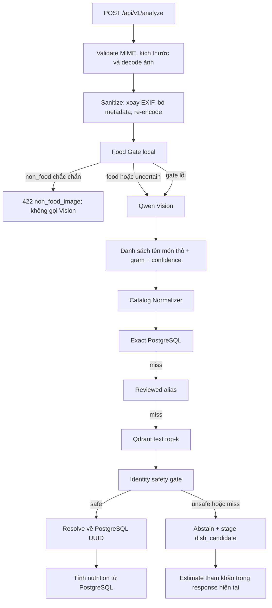

# Kế hoạch Food Gate và chuẩn hóa tên món cho flow Vision-only

Trạng thái: **Planned — chưa triển khai Food Gate; catalog resolver hiện đã có
exact match, reviewed alias, Qdrant fallback và identity guard**

Phạm vi runtime: `POST /api/v1/analyze`

Mục tiêu business:

1. Không gọi Vision cho ảnh chắc chắn không có món ăn, từ đó giảm thời gian và
   chi phí cloud.
2. Chuyển nhiều cách gọi tự do của Vision về một tên món/family ổn định để UI,
   lịch sử ăn uống và thống kê không bị phân mảnh.
3. Không vì chuẩn hóa tên hiển thị mà gắn nhầm dòng dinh dưỡng trong PostgreSQL.
4. Tạo đầy đủ dataset, evaluator, telemetry và release report để kết quả có thể
   kiểm chứng và trình bày trung thực trên CV.

---

## CAPABILITY

Sau khi capability này hoàn thành, người dùng gửi một ảnh lên FoodAI sẽ đi qua
hai tầng kiểm soát:

1. **Food Gate local** phân loại ảnh thành `food`, `non_food` hoặc `uncertain`.
   Ảnh `non_food` đủ chắc chắn bị chặn trước Vision; ảnh `food` và `uncertain`
   vẫn đi Vision để ưu tiên không bỏ sót món ăn thật.
2. **Catalog Normalizer** nhận tên tự do từ Vision, tìm family hiển thị và các
   dòng dinh dưỡng phù hợp trong PostgreSQL. Hệ thống chỉ tự chốt khi bằng chứng
   đủ an toàn; ca mơ hồ phải abstain/chờ duyệt thay vì lấy nutrition của món khác.

Luồng mục tiêu:



### Trạng thái checkout hiện tại

| Thành phần | Trạng thái |
| --- | --- |
| Validate dung lượng/MIME/decode/sanitize | Đã có trong `backend/api/upload_utils.py` |
| Flow `/analyze` gọi Vision trực tiếp | Đã có trong `backend/api/analyze.py` |
| Exact PostgreSQL → reviewed alias → Qdrant | Đã có trong `backend/services/dishes.py` |
| Guard ngăn semantic lookup đổi sai món | Đã có trong `backend/services/catalog_identity.py` |
| Alias nutrition-equivalent đã review | Đã có tại `data/eval/catalog_identity_overrides.json` |
| Stage món chưa có catalog | Đã có qua `dish_candidates` |
| Food/non-food model | Chưa có |
| Dataset và evaluator Food Gate | Chưa có |
| Golden set chuẩn hóa tên món | Chưa có |
| Telemetry `p_food`, gate decision, raw → canonical | Chưa đủ |
| Shadow/canary/rollback cho Food Gate | Chưa có |
| Release report đủ số liệu để ghi CV | Chưa có |

---

## CONSTRAINTS

### Chính sách cố định

- PostgreSQL là nguồn tên canonical và nutrition có thẩm quyền.
- Qdrant chỉ trả candidate; mọi kết quả dùng nutrition phải quay lại PostgreSQL
  bằng UUID.
- Không hardcode danh sách món, alias hoặc threshold trong Python. Family/alias
  là dữ liệu đã review; threshold nằm trong release manifest/config có version.
- Không để Food Gate nhận diện tên món. Nó chỉ trả lời ảnh có đồ ăn/đồ uống hay
  không.
- Food Gate phải ưu tiên **food recall**. Ảnh mơ hồ đi Vision; không chặn theo
  kiểu đoán liều để tiết kiệm tiền.
- Food Gate lỗi hoặc model không load phải fail-open sang Vision, đồng thời log
  sự cố. Rate limit tiếp tục là lớp bảo vệ chi phí khi gate hỏng.
- Vision output là input không tin cậy; phải validate, normalize và giới hạn như
  flow hiện tại.
- Không biến tên family hiển thị thành nutrition identity nếu hai khái niệm đó
  không thật sự tương đương.
- Không viết code đặc biệt cho từng family. Family, alias, variant và member
  relationship phải là dữ liệu đã review trong PostgreSQL.
- Không đưa ảnh người dùng vào train nếu chưa có consent, chưa review và chưa có
  retention policy phù hợp.
- Train/val/test phải tách theo ảnh gốc hoặc nhóm gần trùng; không để biến thể
  của cùng ảnh lọt sang nhiều split.
- Test/golden set đã niêm phong không được dùng để chọn epoch, threshold, alias
  hoặc prompt.
- Mỗi model release phải gắn cùng preprocessing, class map, threshold, dataset
  manifest, checkpoint hash và evaluation report.
- Không ghi số CV từ train accuracy hoặc một vài ảnh demo. Chỉ dùng sealed test
  và số shadow/production có provenance.

### Phân biệt tên family hiển thị và các item tính dinh dưỡng

Đây là nguyên tắc chung cho **mọi món**, không phải logic riêng cho Cơm tấm.
Một family có thể có nhiều cách gọi, nhiều biến thể và một hoặc nhiều item mang
ý nghĩa dinh dưỡng. Ví dụ:

| Tên Vision có thể trả | Family hiển thị | Item cần giữ để resolve nutrition |
| --- | --- | --- |
| Cơm sườn trứng bì | Cơm tấm | Cơm sườn, trứng ốp la, chả/bì nếu nhìn đủ rõ |
| Phở bò tái, phở bò chín | Phở bò | Đúng biến thể phở bò tái hoặc phở bò chín |
| Bún bò giò heo, bún bò chả | Bún bò Huế | Đúng row biến thể hoặc item phụ được Vision tách rõ |
| Bánh mì thịt trứng | Bánh mì | Bánh mì thịt trứng hoặc row tương đương đã review |
| Cơm gà xối mỡ kèm canh | Cơm gà | Cơm gà xối mỡ và canh nếu Vision trả thành item riêng |
| Hủ tiếu khô, hủ tiếu nước | Hủ tiếu | Đúng preparation khô hoặc nước, không gộp nutrition |

`Cơm tấm`, `Phở bò`, `Bánh mì`, `Bún bò Huế` trong bảng chỉ là ví dụ. Runtime
không được chứa nhánh `if` riêng cho bất kỳ family cụ thể nào.

Vì vậy contract phải tách:

- `canonical_family`: tên ổn định phục vụ UI, lịch sử và thống kê, ví dụ
  `Cơm tấm`, `Phở bò`, `Bánh mì` hoặc `Hủ tiếu`.
- `resolved_items`: một hoặc nhiều món/nhóm món thực sự dùng để tính nutrition.
- `vision_raw_name`: tên gốc Vision trả để audit và tạo mapping có review.

Không được dùng một family alias làm nutrition-equivalent nếu row family không
bao gồm đúng biến thể, topping, cách chế biến và khẩu phần. Quy tắc này áp dụng
cho tất cả family, kể cả phở tái/chín, hủ tiếu khô/nước, bánh mì có nhân khác
nhau và các loại cơm/bún có món ăn kèm.

### Ranh giới tin cậy

- Ảnh upload: dữ liệu không tin cậy, phải sanitize trước mọi inference.
- `p_food`: score của model, không phải xác suất tuyệt đối nếu chưa calibration.
- Tên Vision: gợi ý từ model cloud, không phải catalog truth.
- Qdrant score: độ gần vector, không phải xác suất hai món giống hệt nhau.
- Alias/family chỉ có hiệu lực khi `status=reviewed` và target PostgreSQL tồn tại.
- Dinh dưỡng Vision estimate chỉ mang tính tham khảo, không tự publish vào
  catalog.

---

## IMPLEMENTATION CONTRACT

### Actors và surfaces

- **Người dùng:** chụp/upload ảnh, nhận thông báo chụp lại nếu ảnh không có món,
  xem kết quả canonical và gửi feedback đúng/sai.
- **Reviewer/Admin:** duyệt ảnh consent, nhãn Food Gate, raw-name mapping,
  canonical family và nutrition identity.
- **ML Engineer:** quản lý dataset, fine-tune Food Gate, calibration threshold,
  sealed evaluation và model release.
- **Backend:** sanitize ảnh, chạy gate, gọi Vision khi cần, resolve catalog,
  record telemetry và fail-open đúng chính sách.
- **Mobile:** xử lý `non_food_image`, hiển thị nút chụp lại và gửi feedback có
  liên kết `recognition_event_id`.
- **Operator:** theo dõi false reject, Vision call reduction, latency, lỗi gate,
  resolver precision/coverage và kích hoạt rollback.

### Trạng thái request

```text
received
  → validated
  → sanitized
  → gate_food | gate_uncertain | gate_non_food | gate_unavailable

gate_non_food
  → rejected_without_vision

gate_food | gate_uncertain | gate_unavailable
  → vision_called
  → vision_parsed
  → catalog_resolved | catalog_abstained
  → response_returned
```

### Contract Food Gate

Input nội bộ:

```json
{
  "image_bytes": "sanitized JPEG/PNG/WebP bytes",
  "width": 3024,
  "height": 4032
}
```

Output nội bộ:

```json
{
  "decision": "food | non_food | uncertain | unavailable",
  "food_score": 0.012,
  "model_version": "food-gate-mnv3-v1",
  "threshold_version": "food-gate-mnv3-v1-thresholds",
  "latency_ms": 34.7
}
```

Decision rule:

```text
food_score <= T_REJECT     → non_food
food_score >= T_ACCEPT     → food
T_REJECT < score < T_ACCEPT → uncertain
model error                → unavailable → gọi Vision
```

`T_REJECT` và `T_ACCEPT` chỉ được chốt sau threshold sweep trên validation set.
Không dùng các con số ví dụ làm default production.

API behavior đề xuất:

- `non_food`: HTTP 422, machine-readable code `non_food_image`, thông báo tiếng
  Việt và nút chụp lại; không tạo Vision request.
- `food`: tiếp tục gọi Vision.
- `uncertain`: tiếp tục gọi Vision và log `gate_uncertain`.
- `unavailable`: tiếp tục gọi Vision và log `gate_fail_open`.

### Contract Catalog Normalizer

Input cho từng item Vision:

```json
{
  "vision_raw_name": "Cơm sườn trứng ba rọi",
  "is_side": false,
  "grams": 350,
  "recognition_confidence": 0.91
}
```

Output nội bộ:

```json
{
  "vision_raw_name": "Cơm sườn trứng ba rọi",
  "canonical_family_id": "uuid-family-com-tam",
  "canonical_family_name": "Cơm tấm",
  "resolution_status": "resolved | abstained",
  "resolver_method": "exact | reviewed_alias | vector | unresolved",
  "resolved_items": [
    {
      "catalog_id": "uuid-dish-com-suon",
      "canonical_name": "Cơm sườn",
      "nutrition_basis": "source_serving"
    },
    {
      "catalog_id": "uuid-dish-trung-op-la",
      "canonical_name": "Trứng ốp la",
      "nutrition_basis": "source_serving"
    }
  ],
  "resolver_version": "catalog-resolver-v1"
}
```

Thứ tự resolve:

1. Normalize Unicode, chữ hoa/thường và khoảng trắng.
2. Exact normalized match trong PostgreSQL.
3. Nutrition-equivalent alias đã review.
4. Qdrant text retrieval lấy top-k candidate.
5. Tải candidate về từ PostgreSQL bằng UUID.
6. Chạy identity guard; candidate không cùng family hoặc biến đổi ý nghĩa phải
   bị loại.
7. Gắn `canonical_family` riêng với `resolved_items`.
8. Không chắc chắn thì `abstained`, giữ tên Vision và stage candidate để review.

### Data model implications

#### 1. Family taxonomy trong PostgreSQL

Không để family taxonomy thành list Python. Cần thiết kế migration cho:

`dish_families`

- `id`
- `slug` unique, ví dụ `com_tam`
- `display_name`, ví dụ `Cơm tấm`
- `status`: `pending | reviewed | retired`
- `version`
- `created_at`, `updated_at`

`dish_family_aliases`

- `id`
- `family_id`
- `normalized_alias` unique, ví dụ `com suon trung bi`
- `original_alias`
- `status`: `pending | reviewed | rejected`
- `reviewed_by`, `reviewed_at`, `reason`

`dish_family_members`

- `family_id`
- `dish_id` trỏ `vn_dishes.id`
- `relation`: `primary | variant | component`
- unique `(family_id, dish_id)`

File `data/eval/catalog_identity_overrides.json` tiếp tục chỉ phục vụ các alias
nutrition-equivalent đã review. Family alias không được trộn vào file đó nếu
không tương đương nutrition.

#### 2. Recognition telemetry

Mở rộng `recognition_events` hoặc tạo bảng event con để lưu metadata, không lưu
bytes ảnh nếu chưa consent:

- `food_gate_model_version`
- `food_score`
- `food_gate_decision`
- `vision_called`
- `vision_model_version`
- `vision_raw_items` JSONB
- `canonical_family_id`
- `resolver_version`
- `resolver_method`
- `resolved_catalog_ids` JSONB
- `gate_latency_ms`
- `vision_latency_ms`
- `resolver_latency_ms`
- `estimated_vision_cost`

Mọi event phải có request/event ID để feedback của đúng user liên kết lại được.

#### 3. Dataset manifests và release artifacts

Đường dẫn đề xuất:

```text
data/images/food_gate/
├── train/
│   ├── food/
│   └── non_food/
├── val/
│   ├── food/
│   └── non_food/
├── test/
│   ├── food/
│   └── non_food/
└── ood/
    └── non_food/

data/eval/
├── food_gate_v1_manifest.json
├── food_gate_label_policy.md
└── catalog_name_resolution_golden.jsonl

checkpoints/food_gate/v1/
├── model.*
├── manifest.json
└── thresholds.json

ml/evaluation/reports/
├── food_gate_v1_validation.json
├── food_gate_v1_sealed_test.json
├── catalog_resolver_v1_sealed_test.json
├── food_gate_v1_shadow.json
└── vision_pipeline_v1_release.md
```

Không tạo các file report số liệu giả trước khi evaluator thật chạy.

---

## EXECUTION PLAN

### Pha 0 — Đóng băng baseline và policy

Mục tiêu: biết flow hiện tại tốt/xấu ở đâu trước khi thêm model.

Các bước:

1. Ghi version hiện tại của Vision model, prompt, catalog snapshot và resolver.
2. Chốt định nghĩa `food`, `non_food`, `uncertain` bằng ví dụ thật.
3. Chốt policy cho đồ uống, trái cây, đồ đóng gói, menu và ảnh màn hình.
4. Chốt `canonical_family` khác `nutrition identity` như thế nào.
5. Tạo golden set ban đầu cho raw Vision name → expected family/catalog ID.
6. Chạy flow hiện tại trên golden set và lưu raw output trước mọi chỉnh sửa.
7. Đo baseline:
   - tỷ lệ Vision call hiện tại;
   - catalog auto-resolution precision/coverage;
   - unresolved rate;
   - dangerous mismatch rate;
   - Vision latency p50/p95;
   - chi phí trung bình/request.

Artifact bắt buộc:

- `data/eval/food_gate_label_policy.md`
- `data/eval/catalog_name_resolution_golden.jsonl`
- baseline report có timestamp, Git commit và model/catalog version.

Điều kiện hoàn thành:

- Reviewer có thể nhìn một ảnh/tên và gán nhãn theo policy mà không phải đoán ý.
- Golden rows đều có provenance và không lấy từ test output đã bị chỉnh tay sau
  khi xem prediction.

#### Tiến độ Pha 0 — 09/08/2026

- Đã tạo `data/eval/food_gate_label_policy.md`: chốt default cho `food`,
  `non_food`, `uncertain`, consent và ranh giới family hiển thị/nutrition item.
- Đã tạo intake 15 ảnh tại `data/eval/catalog_name_resolution_golden.jsonl`.
  Đây **chưa là sealed golden set** vì source folder cũ không phải ground truth.
- Đã capture Vision pilot 6/15 ảnh tại
  `data/eval/catalog_name_resolution_phase0_raw_capture.jsonl`; provider thành
  công 6/6, latency p50 4.957,4 ms và p95 nearest-rank 5.355,5 ms.
- Pilot phát hiện raw name Vision khác source label ở 6/6 case. Visual review
  xác nhận ít nhất hai ảnh folder `banh_canh` không rõ là bánh canh; dừng các
  call còn lại để không tiêu tiền trên bộ test chưa review.
- Đã khởi động local datastore; PostgreSQL có 834 `vn_dishes`, Qdrant healthz
  pass. Có exact row cho `Phở bò chín`, `Bánh canh thịt heo`, `Há cảo`.
- Baseline catalog precision/coverage, unresolved rate, dangerous mismatch,
  Vision call rate production và cost/request vẫn **pending** cho đến khi có
  human-reviewed golden rows và full run. Không được dùng pilot này làm metric
  cuối hoặc đưa vào CV.

### Pha 1 — Thu thập và làm sạch dataset Food Gate

Mục tiêu: có dữ liệu đại diện camera app, không chỉ ảnh web đẹp.

#### 1. Nhãn `food`

Bao gồm:

- Món Việt và món phổ biến khác.
- Đồ uống cần phân tích dinh dưỡng.
- Trái cây, snack và thực phẩm đóng gói nếu app muốn hỗ trợ.
- Ảnh tối, rung nhẹ, crop một phần, nhiều góc và nhiều khoảng cách.
- Một món, nhiều món, món trong hộp, món trên bàn nhiều vật dụng.
- Hard positive: món nhỏ, nền phức tạp, chỉ thấy một phần đĩa.

#### 2. Nhãn `non_food`

Bao gồm:

- Người, thú cưng, phong cảnh, xe và đồ gia dụng.
- Tài liệu, màn hình, screenshot, QR, logo và menu chữ.
- Bàn trống, đĩa/tô rỗng, dao muỗng không có thức ăn.
- Bao bì kín không nhìn thấy thực phẩm nếu policy không hỗ trợ.
- Ảnh đen, quá mờ hoặc vật thể lạ.
- Hard negative có màu/hình giống thức ăn.

#### 3. Số lượng thực dụng

POC đầu tiên:

- 500–1.000 ảnh `food`.
- 500–1.000 ảnh `non_food`.
- Test tối thiểu 300 ảnh mỗi nhóm.

Release đáng tin cậy hơn:

- Cố gắng có ít nhất 1.000 ảnh food và 1.000 ảnh non-food trong sealed test nếu
  muốn tuyên bố food recall quanh 99% với bằng chứng mạnh.
- Shadow phải bổ sung ảnh camera thật và hard cases, không chỉ ảnh public.

#### 4. Kiểm tra dữ liệu

1. Decode toàn bộ bằng Pillow.
2. Loại file hỏng, kích thước 0 và định dạng giả.
3. Dùng SHA-256 bắt duplicate byte-identical.
4. Dùng pHash bắt near-duplicate.
5. Review bằng mắt mọi cặp cross-label gần trùng.
6. Nhóm ảnh theo source/user/session/original để split cùng nhóm.
7. Ghi license/provenance cho dữ liệu public.
8. Chỉ dùng feedback user có `consent + approved + reviewed_at`.
9. Tạo manifest chứa path, label, split, source, checksum và review status.

#### 5. Chia split

Khuyến nghị ban đầu:

- Train 70%.
- Validation 15%.
- Test 15%.
- OOD giữ riêng, không dùng để chọn từng ảnh hardcode vào rule.

Split theo group trước rồi mới augmentation. Không augmentation rồi mới chia.

Điều kiện hoàn thành:

- Không có duplicate/near-duplicate chéo split chưa được xử lý.
- Không có cross-label conflict chưa review.
- Manifest tái tạo được cùng danh sách train/val/test.
- Test set được đánh dấu sealed.

### Pha 2 — Xây evaluator trước khi train

Mục tiêu: mọi thử nghiệm đều sinh cùng loại report, tránh chọn model bằng cảm
giác.

CLI cần xây dựng:

```text
uv run python -m ml.evaluation.evaluate_food_gate --manifest ... --checkpoint ...
uv run python -m ml.evaluation.evaluate_catalog_resolver --golden ...
```

Đây là command contract cần triển khai, chưa phải command đã có trong checkout.

Evaluator Food Gate phải xuất:

- confusion matrix;
- food recall;
- false reject rate;
- non-food rejection rate;
- rejection precision;
- accuracy và balanced accuracy;
- PR curve hoặc threshold sweep;
- số ảnh `food`, `non_food`, `uncertain` theo từng threshold;
- latency p50/p95;
- peak RSS/model size nếu đo serving;
- breakdown theo camera/upload, ánh sáng, blur và nhóm hard negative.

Evaluator Catalog Normalizer phải xuất:

- family top-1 accuracy;
- auto-resolution precision;
- coverage;
- abstention/unresolved rate;
- dangerous mismatch rate;
- nutrition identity precision;
- component precision/recall/F1;
- candidate Recall@1/3/5 và MRR@10 cho nhánh Qdrant;
- breakdown theo resolver method: exact, alias, vector, unresolved;
- breakdown theo từng family và loại cấu trúc: món đơn, variant, topping, combo;
- confusion pairs phổ biến.

Mỗi report phải chứa:

- `generated_at`;
- Git commit;
- dataset manifest checksum;
- checkpoint/model hash;
- preprocessing version;
- threshold version;
- catalog snapshot/version;
- số lượng sample và exclusions;
- metrics tổng và per-group.

Điều kiện hoàn thành:

- Cùng input/version chạy lại cho kết quả giống nhau trong sai số cho phép.
- Unit test xác nhận công thức metric bằng các confusion matrix nhỏ biết trước.
- Evaluator từ chối manifest có duplicate chéo split hoặc thiếu label bắt buộc.

### Pha 3 — Fine-tune Food Gate

Mục tiêu: model nhỏ, nhanh và đủ an toàn để làm cost gate.

Baseline đề xuất: `MobileNetV3-Small` pretrained, input `224 × 224`, hai class
`food` và `non_food`.

Recipe thử nghiệm đầu tiên:

1. Dùng đúng resize/normalize của pretrained weights.
2. Thay classifier head bằng output hai lớp.
3. Freeze backbone, train head khoảng 5 epoch.
4. Unfreeze các block cuối, fine-tune thêm 10–20 epoch.
5. Dùng AdamW; learning rate head có thể bắt đầu khoảng `1e-3`, fine-tune
   khoảng `1e-4`, nhưng phải ghi vào config và xác nhận bằng validation.
6. Batch size bắt đầu 32; giảm 16 nếu thiếu RAM.
7. Augmentation nhẹ: crop vừa phải, thay đổi sáng/màu, blur nhẹ, xoay nhỏ.
8. Không crop/blur đến mức biến ảnh food thành non-food về mặt nội dung.
9. Nếu class imbalance, dùng weighted sampler hoặc class-weight; ghi rõ trong
   report.
10. Early stopping dựa trên validation food recall/false reject, không chỉ loss.
11. Lưu checkpoint tốt nhất cùng manifest, không chỉ file weight.

Không dùng QLoRA/LoRA cho MobileNetV3. Đây là CNN nhỏ; fine-tune head rồi mở vài
block cuối đơn giản và phù hợp hơn.

Thí nghiệm tối thiểu cần so sánh:

- Pretrained backbone + chỉ train head.
- Fine-tune các block cuối.
- Có/không có hard-negative augmentation.
- Hai mức input nếu latency cho phép; chỉ promote nếu sealed metric tốt hơn.

Không chọn thí nghiệm bằng test set.

Điều kiện chuyển pha:

- Validation food recall đạt mục tiêu.
- Đã chọn được `T_REJECT` và `T_ACCEPT` bằng threshold sweep.
- Không có hard-negative group nào sụp đổ rõ rệt mà metric tổng che khuất.

### Pha 4 — Calibration và sealed test Food Gate

Mục tiêu: khóa model + threshold trước khi tích hợp runtime.

Các bước:

1. Chọn checkpoint bằng validation.
2. Sweep `T_REJECT` để ưu tiên false reject thấp.
3. Chọn `T_ACCEPT` để phân biệt food rõ với uncertain; food và uncertain đều
   vẫn gọi Vision nên đây không phải cost-risk gate chính.
4. Nếu score quá tự tin/thiếu calibration, thử temperature scaling trên val.
5. Khóa checkpoint, preprocessing và thresholds.
6. Chạy sealed test đúng một release evaluation.
7. Chạy riêng OOD test.
8. Lưu confusion examples để review, không chuyển chúng ngược vào test sau khi
   đã xem kết quả.

Offline release gate đề xuất:

| Metric | Gate |
| --- | ---: |
| Food recall trên sealed test | ≥ 99% |
| False reject rate | ≤ 1% |
| Rejection precision | ≥ 99% |
| Non-food rejection rate | Báo cáo, không hy sinh food recall để ép cao |
| OOD false reject food | ≤ 1% nếu OOD set có hard-positive |
| Gate p95 latency | Đo trên production-equivalent CPU; chốt SLO sau benchmark |

Nếu không pass food recall/rejection precision, không bật block production.
Model vẫn có thể chạy shadow để thu hard examples.

### Pha 5 — Hoàn thiện Catalog Normalizer

Mục tiêu: family ổn định nhưng nutrition vẫn đúng theo item.

Các bước:

1. Inventory toàn bộ `vn_dishes` canonical có nutrition/serving hợp lệ.
2. Tạo và review `dish_families`, bắt đầu từ nhóm có traffic thật cao.
3. Link từng `vn_dishes` row vào family; không đoán link từ tên nếu chưa review.
4. Thu raw names thật từ Vision trên golden/feedback.
5. Gán mỗi raw name thành một trong ba loại:
   - nutrition-equivalent alias;
   - family-only alias;
   - unresolved/ambiguous.
6. Chỉ nutrition-equivalent alias mới được phép đổi thẳng catalog row.
7. Family-only alias chỉ đổi tên hiển thị/thống kê, không thay nutrition item.
8. Qdrant trả top-k candidate, sau đó resolver xác minh UUID và identity guard.
9. Nếu Vision trả nhiều item thuộc cùng một bữa/combo, giữ từng item có ý nghĩa
   nutrition rồi gắn family tổng phù hợp. Ví dụ `Cơm sườn`, `Trứng ốp la`,
   `Chả bì` có thể hiển thị family `Cơm tấm`; `Cơm gà xối mỡ` và `Canh rau` có
   thể hiển thị family `Cơm gà` nhưng vẫn tính hai item riêng.
10. Nếu Vision gộp một chuỗi nhưng không đủ bằng chứng phân tách topping, không
    tự bịa component; resolve phần chắc chắn và đánh dấu thiếu/mơ hồ.
11. Unknown phải stage vào review queue; reviewer có thể thêm family alias hoặc
    nutrition-equivalent alias sau khi đối chiếu catalog.
12. Version resolver/family taxonomy và re-run golden evaluator sau mỗi batch
    alias/catalog thay đổi.
13. Golden set phải có nhiều family và nhiều dạng cấu trúc: món đơn, biến thể
    chế biến, món có topping, combo nhiều item và món phụ. Không được pass release
    chỉ bằng test cases của một family.

Golden JSONL đề xuất:

```json
{"case_id":"name-0001","vision_raw_items":["Cơm sườn","Trứng ốp la","Chả bì"],"expected_family_slug":"com_tam","expected_catalog_ids":["uuid-com-suon","uuid-trung-op-la","uuid-cha-bi"],"must_abstain":false,"split":"test","source_group":"camera-session-001"}
{"case_id":"name-0002","vision_raw_items":["Cơm thịt trứng bì"],"expected_family_slug":"com_tam","expected_catalog_ids":[],"must_abstain":true,"split":"test","source_group":"camera-session-002"}
{"case_id":"name-0003","vision_raw_items":["Phở bò tái"],"expected_family_slug":"pho_bo","expected_catalog_ids":["uuid-pho-bo-tai"],"must_abstain":false,"split":"test","source_group":"camera-session-003"}
{"case_id":"name-0004","vision_raw_items":["Hủ tiếu khô"],"expected_family_slug":"hu_tieu","expected_catalog_ids":["uuid-hu-tieu-kho"],"must_abstain":false,"split":"test","source_group":"camera-session-004"}
{"case_id":"name-0005","vision_raw_items":["Bánh mì thịt trứng"],"expected_family_slug":"banh_mi","expected_catalog_ids":[],"must_abstain":true,"split":"test","source_group":"camera-session-005"}
```

Các UUID trên chỉ minh họa schema. Khi tạo golden thật phải lấy UUID tồn tại từ
PostgreSQL; không copy placeholder này vào evaluator hoặc runtime.

Catalog release gate đề xuất:

| Metric | Gate |
| --- | ---: |
| Family auto-resolution precision | ≥ 98% |
| Nutrition identity precision | ≥ 99% |
| Dangerous mismatch rate | ≤ 0,5% |
| Candidate Recall@5 | Báo cáo và cải thiện; không tự chốt chỉ vì nằm top-5 |
| Coverage | Báo cáo; không hạ precision để ép coverage |
| Component F1 | Báo cáo riêng cho nhóm combo |

Không fine-tune Vision chỉ để sửa synonym. Chỉ cân nhắc fine-tune/rerank text
resolver khi đã có đủ raw-name → catalog-ID có review và exact/alias/vector
vẫn miss có hệ thống.

### Pha 6 — TDD và tích hợp backend

Mục tiêu: thêm gate mà không làm hỏng flow Vision-only hiện tại.

Thứ tự TDD:

1. Viết test cho decision contract và hai threshold boundary.
2. Viết test preprocessing giống hệt train/serving.
3. Viết test model unavailable phải gọi Vision.
4. Viết endpoint test `non_food` không gọi `identify_dish()`.
5. Viết endpoint test `uncertain` gọi Vision đúng một lần.
6. Viết endpoint test `food` gọi Vision đúng một lần.
7. Viết integration test telemetry theo từng decision.
8. Viết resolver test exact, reviewed alias, family-only alias, vector-safe,
   vector-unsafe và unresolved.
9. Viết test không lấy nutrition family chung thay cho topping cụ thể.
10. Viết test data-driven cho ít nhất 5 family khác nhau để chứng minh runtime
    không phụ thuộc riêng `Cơm tấm`.
11. Viết migration/model tests cho family taxonomy và telemetry.
12. Implement service sau khi test contract đỏ đúng lý do.
13. Chạy focused tests, rồi full regression.

Test matrix bắt buộc:

| Ca | Gate | Vision | Resolver/API mong đợi |
| --- | --- | --- | --- |
| Ảnh con mèo rõ | non_food | Không gọi | 422 `non_food_image` |
| Ảnh bàn mờ | uncertain | Gọi 1 lần | Flow Vision bình thường |
| Ảnh món rõ | food | Gọi 1 lần | Flow Vision bình thường |
| Model gate lỗi | unavailable | Gọi 1 lần | Không làm hỏng request |
| Vision lỗi sau food | food | Gọi và lỗi | Thông báo Vision gián đoạn hiện tại |
| Tên exact | food | Gọi | UUID PostgreSQL exact |
| Alias nutrition đã duyệt | food | Gọi | UUID alias target |
| Alias family-only | food | Gọi | Đổi family, không đổi nutrition item |
| Qdrant candidate sai family | food | Gọi | Abstain, không lấy nutrition sai |
| Món mới | food | Gọi | Estimate tham khảo + stage candidate |

### Pha 7 — Mobile UX

Các bước:

1. Parse lỗi typed `non_food_image`.
2. Hiển thị: “Ảnh này chưa thấy món ăn. Hãy chụp gần món hơn.”
3. Có nút `Chụp lại` và `Vẫn gửi phân tích` nếu product cho phép override.
4. Nếu cho override, backend phải rate-limit và log reason; override gọi Vision.
5. Không hiển thị `food_score` cho user vì score không phải xác suất dễ hiểu.
6. Feedback sai tên món phải gửi `recognition_event_id` và tên user chọn.
7. Test camera, gallery, retry, timeout, non-food và accessibility.

Quyết định còn mở: có cho user override non-food gate hay không. Khuyến nghị có
override một lần để cứu false reject, nhưng phải theo dõi chi phí/abuse.

### Pha 8 — Shadow mode

Mục tiêu: đo trên traffic thật mà chưa chặn người dùng.

Behavior:

```text
Food Gate dự đoán non_food
        ↓
Chỉ log decision
        ↓
Vẫn gọi Vision như flow hiện tại
        ↓
Đối chiếu với Vision output + feedback đã review
```

Các bước:

1. Deploy model với `FOOD_GATE_MODE=shadow` hoặc config tương đương.
2. Gắn model/threshold version vào event.
3. Thu ít nhất 1.000 request tổng và tối thiểu 300 mẫu có ground truth/review
   trước quyết định block; tăng số mẫu nếu traffic phân bố lệch.
4. Tách metric camera và gallery.
5. Review mọi ảnh gate muốn chặn nhưng Vision nhận ra món.
6. Tính false reject, non-food rejection, Vision call reduction giả định,
   latency overhead và cost saving giả định.
7. Bổ sung hard examples vào **train của release kế tiếp**, không sửa test hiện
   tại.

Shadow gate:

- Food recall sau review ≥ 99%.
- Rejection precision ≥ 99%.
- Không có nhóm đồ uống/trái cây/món tối bị chặn hàng loạt.
- Gate p95 không làm end-to-end p95 vượt SLO đã chốt.
- Telemetry và rollback flag hoạt động.

### Pha 9 — Canary và rollout

Mục tiêu: bật chặn theo từng bước, có thể rollback ngay.

Trình tự đề xuất:

1. Canary 5% traffic.
2. Giữ tối thiểu 3 ngày hoặc đủ 500 request trước khi nâng tỷ lệ.
3. Nâng 25% → 50% → 100% nếu mọi gate vẫn pass.
4. Mỗi nấc phải kiểm tra false reject, override rate, complaint rate, Vision
   call reduction, p95 latency và gate failure rate.
5. Resolver family chạy shadow trước nếu thay đổi response/UI; nutrition identity
   guard vẫn bắt buộc ngay từ đầu.

Rollback ngay khi:

- Food false reject vượt 1% trên sample đã review.
- Rejection precision dưới 99%.
- Gate crash/load failure tăng bất thường.
- Latency vượt SLO.
- Vision call không giảm nhưng UX xấu hơn.
- Dangerous catalog mismatch vượt 0,5%.

Rollback action:

- Chuyển gate về `shadow` hoặc `disabled` qua config.
- Không xóa checkpoint/report cũ.
- Giữ event version để phân tích nguyên nhân.
- Resolver unsafe phải chuyển `abstain`, không rollback bằng cách bỏ identity
  guard.

### Pha 10 — Production monitoring và retraining

Dashboard tối thiểu:

- Request theo `food`, `non_food`, `uncertain`, `unavailable`.
- Food Gate model version/threshold version.
- Vision call count và call reduction thực tế.
- Vision cost/ngày và cost/request.
- Gate latency, Vision latency, resolver latency, end-to-end latency p50/p95.
- Override và user correction rate.
- Resolver method distribution.
- Auto-resolution precision/coverage trên mẫu đã review.
- Unresolved/staged candidate rate.
- Dangerous mismatch và top confusion pairs.

Chu kỳ vận hành:

- Hằng ngày: lỗi, latency, Vision calls, override/complaint.
- Hằng tuần: review false rejects, unresolved names và confusion groups.
- Mỗi release: sealed evaluation lại với test version mới được quản lý riêng.
- Retrain khi drift có bằng chứng, không train theo lịch nếu dữ liệu chưa đủ.

Retraining data gate:

- Chỉ `approved + consent + reviewed label + reviewed_at`.
- Deduplicate và group-split lại.
- Không tự đưa production feedback vào test cũ.
- Challenger phải đánh bại champion trên cùng evaluator trước khi canary.

---

## METRICS VÀ CÁCH TÍNH

Quy ước `food` là positive class:

- `TP`: ảnh food được cho qua.
- `FN`: ảnh food bị chặn nhầm.
- `TN`: ảnh non-food bị chặn đúng.
- `FP`: ảnh non-food vẫn được cho qua Vision.

### Food Gate

```text
Food Recall = TP / (TP + FN)
False Reject Rate = FN / (TP + FN)
Non-food Rejection Rate = TN / (TN + FP)
Rejection Precision = TN / (TN + FN)
Vision Call Reduction = số request bị chặn trước Vision / tổng request
```

Ví dụ minh họa, không phải kết quả project:

- 1.000 ảnh food, chặn nhầm 5 → food recall `99,5%`.
- 1.000 ảnh non-food, chặn được 700 → non-food rejection `70%`.
- Tổng 2.000 ảnh cân bằng, tránh 700 Vision calls → call reduction `35%` trên
  tập minh họa; production phải tính theo traffic thật.

### Catalog Normalizer

```text
Family Top-1 Accuracy = family đúng / tổng case có nhãn
Auto-resolution Precision = số auto-resolve đúng / tổng auto-resolve
Coverage = tổng auto-resolve / tổng request
Abstention Rate = tổng abstain / tổng request
Dangerous Mismatch Rate = số auto-resolve sai catalog / tổng request
Nutrition Identity Precision = catalog nutrition ID đúng / tổng ID tự chốt
```

Ranking Qdrant:

- `Recall@5`: expected catalog ID có nằm trong 5 candidate đầu không.
- `MRR@10`: đúng hạng 1 được 1 điểm, hạng 2 được 1/2, hạng 3 được 1/3; lấy
  trung bình toàn bộ query.

MRR/Recall@5 chỉ đánh giá candidate retrieval. Nó không thay cho final
auto-resolution precision vì resolver vẫn có thể chọn sai từ shortlist.

### Khi nào đo metric nào

| Thời điểm | Dữ liệu | Mục đích | Được dùng trên CV? |
| --- | --- | --- | --- |
| Trước thay đổi | Baseline/golden | Chứng minh cải thiện | Có, nếu ghi rõ baseline |
| Trong train | Train | Theo dõi loss/overfit | Không dùng làm kết quả chính |
| Chọn epoch/threshold | Validation | Chọn model và threshold | Không gọi là final test |
| Sau khi khóa release | Sealed test | Offline kết quả cuối | Có |
| Shadow | Traffic thật có review | Kiểm tra domain shift/cost giả định | Có, ghi rõ shadow |
| Canary | Traffic production nhỏ | Kiểm tra an toàn rollout | Có, ghi rõ canary |
| Production | Traffic thật | Business impact và drift | Có, tốt nhất |

Nếu test được xem và dùng để chỉnh model nhiều lần, nó đã trở thành validation;
phải tạo test version mới độc lập trước khi tuyên bố kết quả cuối.

---

## OBSERVABILITY VÀ CHI PHÍ

Metrics cần bổ sung ở Prometheus hoặc report pipeline:

- `food_gate_decisions_total{decision,model_version}`
- `food_gate_latency_seconds{model_version}`
- `food_gate_fail_open_total{reason}`
- `vision_calls_total{gate_decision,outcome}`
- `catalog_resolution_total{method,outcome,resolver_version}`
- `catalog_resolution_latency_seconds{method}`
- `non_food_override_total`

Không đưa `dish_name`, user ID hoặc raw text có cardinality cao vào Prometheus
label. Các giá trị này nằm trong PostgreSQL event/report có kiểm soát.

Cost report theo ngày:

```text
baseline_expected_calls = tổng request đủ điều kiện trước gate
actual_vision_calls = số request thật sự gọi Vision
avoided_calls = baseline_expected_calls - actual_vision_calls
estimated_saving = avoided_calls × provider_cost_per_call
```

Giá Vision thay đổi theo provider/model nên lấy từ config vận hành hoặc billing
export, không hardcode vào metric code.

---

## SECURITY, PRIVACY VÀ FAILURE MODES

### Security/privacy

- Tiếp tục dùng validate/sanitize hiện tại trước inference.
- Giới hạn dung lượng, pixel count và request rate.
- Không log ảnh/base64, API key hoặc provider response body.
- Không lưu ảnh non-food mặc định; chỉ lưu nếu user consent theo feedback flow.
- Event chỉ lưu score, decision, version và tên/UUID cần audit.
- Object storage feedback tiếp tục có retention và quyền admin review.

### Failure matrix

| Sự cố | Hành vi |
| --- | --- |
| Ảnh sai MIME/file hỏng/quá lớn | Từ chối trước gate |
| Food Gate model không load | Fail-open sang Vision + alert |
| Food Gate timeout | Fail-open sang Vision + metric timeout |
| Score nằm vùng uncertain | Gọi Vision |
| Vision timeout/quota lỗi | Trả lỗi Vision hiện tại, không bịa local result |
| PostgreSQL lỗi | Không dùng Qdrant làm nutrition truth |
| Qdrant text lỗi | Exact/alias PostgreSQL vẫn chạy, semantic fallback bỏ qua |
| Candidate khác family | Abstain + stage, không auto-resolve |
| Family taxonomy thiếu | Giữ tên resolved item hiện tại, không chặn nutrition hợp lệ |
| Telemetry lỗi | Best-effort; không làm request chính thất bại |

---

## TEST VÀ VERIFICATION CHECKLIST

### Static/unit

- [ ] Label policy có ví dụ cho mọi nhóm mơ hồ.
- [ ] Manifest validator bắt path thiếu, label sai, checksum sai.
- [ ] Duplicate/leakage test pass.
- [ ] Train/serving preprocessing parity test pass.
- [ ] Threshold boundary tests pass.
- [ ] Metric formula tests pass.
- [ ] Alias/family review-status tests pass.
- [ ] Catalog target UUID phải tồn tại trong PostgreSQL.
- [ ] Nutrition-equivalent và family-only alias không bị trộn.

### API/integration

- [ ] Non-food không gọi Vision.
- [ ] Food/uncertain/gate-unavailable gọi Vision đúng một lần.
- [ ] Response/error contract tương thích mobile.
- [ ] Exact/alias/vector/unresolved resolver paths đều có test.
- [ ] Qdrant hit luôn quay về PostgreSQL UUID.
- [ ] Tên family không làm mất resolved nutrition items.
- [ ] Test nhiều family chứng minh không có nhánh xử lý riêng theo tên món.
- [ ] Món mới vẫn stage đúng policy.
- [ ] Telemetry failure không phá `/analyze`.

### ML evaluation

- [ ] Validation threshold sweep report tồn tại.
- [ ] Sealed test report chứa manifest/checkpoint hash.
- [ ] OOD report tồn tại.
- [ ] Per-group metrics không có nhóm critical bị che bởi average.
- [ ] Confusion examples được review.
- [ ] Champion/challenger dùng cùng evaluator.

### Runtime/release

- [ ] Model load/readiness test pass.
- [ ] Production-equivalent CPU latency/RSS benchmark đã chạy.
- [ ] Shadow gate pass.
- [ ] Canary 5% pass.
- [ ] Rollback flag đã thử thật.
- [ ] Dashboard/alert hiển thị đúng model version.
- [ ] Vision billing/call count đối soát được.
- [ ] Full backend/mobile regression pass.

---

## CV / PORTFOLIO EVIDENCE

Không ghi ranking nếu project không tham gia cuộc thi. `MRR@10` là retrieval
metric, không phải thứ hạng cuộc thi.

Chỉ điền các ô sau bằng số từ sealed report hoặc production dashboard:

```text
Built a cost-aware Vietnamese food analysis pipeline using a fine-tuned
MobileNetV3 food/OOD gate before Qwen Vision, achieving [food recall]% food
recall and reducing paid Vision calls by [call reduction]% on [N] evaluated
images/production requests.

Developed a guarded catalog normalizer combining PostgreSQL exact matching,
reviewed aliases and Qdrant top-k retrieval, achieving [precision]% automatic
resolution precision at [coverage]% coverage with [dangerous mismatch]% unsafe
catalog mismatches.

Implemented versioned datasets, threshold calibration, sealed evaluation,
shadow/canary rollout, latency/cost monitoring and safe abstention for uncertain
predictions.
```

Evidence package để phỏng vấn:

- Sơ đồ flow trước/sau.
- Dataset manifest và label policy.
- Confusion matrix Food Gate.
- Threshold sweep chart.
- Precision/coverage curve Catalog Normalizer.
- Một bảng hard cases trước/sau.
- Shadow/canary report.
- Cost và latency dashboard.
- Release manifest chứng minh số nào thuộc model/version nào.

---

## NON-GOALS

- Không quay lại phân loại hàng trăm tên món bằng EfficientNet/SigLIP.
- Không dùng Food Gate để trả tên món hoặc nutrition.
- Không fine-tune Vision chỉ để sửa cách gọi tên khác catalog.
- Không tự động publish món mới hoặc alias mới từ prediction/user text chưa
  review.
- Không dùng Qdrant vector làm nutrition source.
- Không cố chặn 100% non-food nếu điều đó làm tăng false reject food.
- Không tách mọi hành lá, dưa leo, nước chấm thành component. Chỉ giữ các nhóm
  có ý nghĩa menu/nutrition theo prompt và policy đã review.
- Không tuyên bố tiết kiệm chi phí trước khi đo traffic thật.

---

## OPEN QUESTIONS

Các câu hỏi này không chặn việc chuẩn bị dataset/evaluator, nhưng phải chốt trước
production block:

1. Đồ uống, thực phẩm đóng gói kín và ảnh menu được tính là `food` hay
   `non_food`?
2. Mobile có nút “Vẫn phân tích” khi gate chặn hay không?
3. Production serving dùng PyTorch trực tiếp hay export ONNX sau benchmark?
4. Production CPU/RAM target cụ thể là gì để chốt latency/RSS SLO?
5. Family taxonomy được quản lý qua admin API/UI hay migration + review script
   trong giai đoạn đầu?
6. Những family nào được ưu tiên ở release đầu, catalog row/variant/component
   nào thuộc từng family và item nào đã có nutrition đủ tin cậy?
7. Provider billing export nào là nguồn truth cho cost/call?
8. Ai là reviewer có quyền approve family alias và nutrition-equivalent alias?

Khuyến nghị mặc định:

- Đồ uống và thực phẩm nhìn thấy rõ được tính là `food`.
- Menu/screenshot và bao bì kín không nhìn thấy thực phẩm là `non_food`.
- Cho user override một lần để cứu false reject, có rate limit.
- Dùng PyTorch cho POC; chỉ đổi ONNX khi benchmark chứng minh cần thiết.
- Bắt đầu family taxonomy bằng PostgreSQL migration + admin review API tối thiểu,
  không hardcode Python.

---

## HANDOFF VÀ THỨ TỰ THỰC THI

Capability này **chưa sẵn sàng bật production ngay**, nhưng đã đủ contract để
bắt đầu triển khai theo TDD sau khi chốt label policy và bốn câu hỏi runtime
quan trọng: override UX, serving format, hardware SLO và reviewer authority.

Thứ tự không được đảo:

1. Chốt label/family policy.
2. Tạo golden set và baseline report.
3. Thu thập, review, deduplicate và split dataset.
4. Xây evaluator + metric tests.
5. Fine-tune Food Gate.
6. Chọn threshold bằng validation.
7. Khóa release và chạy sealed test/OOD.
8. Tạo PostgreSQL family taxonomy và hoàn thiện resolver.
9. Viết TDD cho backend/API/mobile.
10. Tích hợp gate ở sau sanitize, trước Vision.
11. Bổ sung telemetry/dashboard/cost report.
12. Chạy shadow.
13. Chạy canary 5% → 25% → 50% → 100%.
14. Lưu release evidence và chỉ sau đó mới ghi metric vào CV.

Definition of Done cuối cùng:

- [ ] Food Gate pass offline, OOD, shadow và canary gates.
- [ ] Non-food production request không gọi Vision.
- [ ] Food false reject ≤ 1% trên sample đã review.
- [ ] Catalog family precision ≥ 98%.
- [ ] Nutrition identity precision ≥ 99%.
- [ ] Dangerous mismatch ≤ 0,5%.
- [ ] PostgreSQL vẫn là nutrition truth.
- [ ] Không hardcode class/alias/threshold trong runtime code.
- [ ] User feedback có consent/review gate.
- [ ] Rollback đã được thử.
- [ ] Report có dataset/model/catalog/threshold version và checksum.
- [ ] CV chỉ dùng số đã được report xác nhận.
